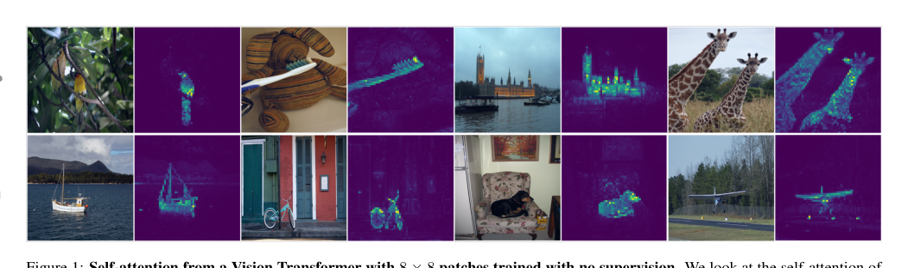
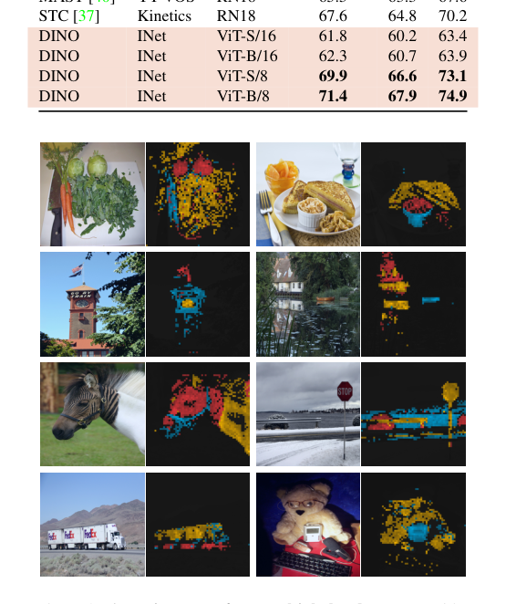
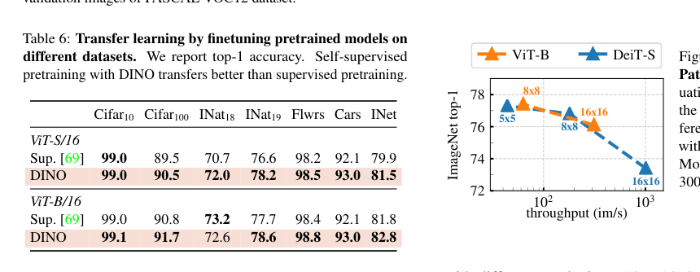
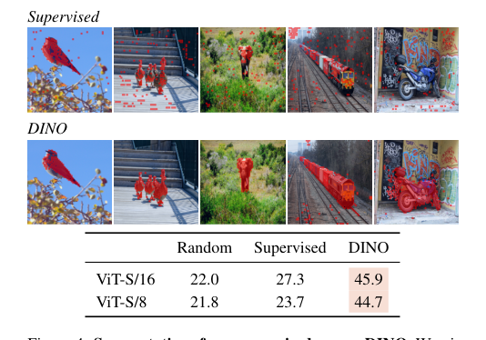
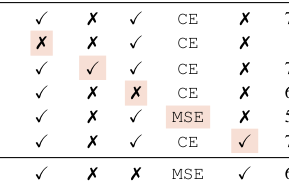
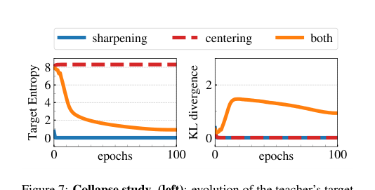

# 📄 gs, gt: student and teacher networks

# DINO：无监督知识蒸馏解锁视觉Transformer潜力分析

## 概要（TL;DR）
*   **核心问题**：视觉Transformer（ViT）在监督训练下未能展现超越卷积网络的独特优势，面临“合理性危机”。
*   **关键洞察**：将自监督学习重新定义为**无标签的知识蒸馏**，提出DINO框架，通过动量教师、多裁剪和中心化/锐化操作避免模型坍缩。
*   **惊人发现**：DINO训练出的ViT，其自注意力机制能够**在无任何像素级标注的情况下，自发地学习分割图像中的物体**。
*   **卓越性能**：在多项任务（如图像分类、检索、分割）上达到或超越前沿水平，且ViT-B/8模型以**仅1/10的参数**和**更快的速度**，实现了与巨型卷积网络相当的精度。
*   **重要意义**：首次清晰地证明了自监督学习能够释放ViT的架构潜力，为其在计算机视觉领域的应用提供了强有力的理由。

## 📚 研究背景与动机
卷积神经网络（CNN）统治计算机视觉领域近十年。视觉Transformer的出现曾带来巨大冲击，其基于自注意力的架构灵感源于自然语言处理的成功。然而，ViT初期的表现不尽如人意：计算成本高、数据需求量大，并且最关键的是，相比成熟的CNN并未展现出明确且独特的优势。

与此同时，自监督学习在计算机视觉领域蓬勃发展。其核心思想是让模型通过解决前置任务（如预测图像旋转、对比不同视图）来学习强大的、可迁移的特征表示，而无需人工标注。在NLP领域，正是自监督学习（如BERT的掩码语言建模）成就了Transformer的统治地位。这引出了一个关键问题：**将自监督学习与ViT结合，能否解锁其潜在能力，并揭示监督训练无法获得的独特视觉特性？**

论文表面探讨的是ViT的“初期表现平淡”，但其深层次意图是解决ViT在视觉领域的 **“合理性危机”** 。它是一个昂贵而复杂的方案，却缺乏令人信服的优势。作者假设，这种优势的缺失源于**监督预训练范式本身**。具体而言，图像级别的监督标签（如“狗”）是一种**简化且信息贫乏的学习信号**，无法充分捕获图像中丰富的结构信息（如物体部件、边界、场景布局）。本文旨在证明，当ViT通过自监督学习摆脱这种弱信号的束缚后，能够学到与监督训练**本质不同且更有用的特征表示**，从而证明其架构复杂性的价值。

此前工作的局限性体现在三方面：
1.  **监督ViT**：基本在复现CNN的功能，且效率更低，其特征并未展现出新颖的理想特性。
2.  **面向CNN的自监督方法**：虽强大，但通常依赖复杂的工程技巧（如大批次、内存库、预测头），其设计和评估围绕CNN展开，未必是激发ViT潜力的最优解。
3.  **自监督中的知识蒸馏**：以往工作仅将蒸馏用作模型压缩的后处理步骤，错失了将蒸馏**框架本身**作为动态自监督目标核心的机会。

## 🔬 方法详解
DINO的核心是将表示学习**重构为一个无标签的知识蒸馏问题**。其基本设定是：训练一个学生网络，使其输出分布与一个教师网络的输出分布相匹配。而教师网络是学生网络的动量更新版本。为防止输出坍缩（如全部输出相同或均匀分布），DINO引入了**中心化**和**锐化**操作。

*DINO训练出的ViT-S/8模型的[CLS]令牌自注意力图，展示了无监督下的类特定对象分割能力。*

**核心机制：**
1.  **网络结构与输出**：学生和教师网络共享架构（ViT或ResNet），后接一个投影头（小MLP），输出一个K维向量（K为原型数量，如65，536）。通过温度系数τ控制的Softmax，将输出转换为概率分布：
    **学生分布**：$$P_s(x)^{(i)} = \frac{\exp\left(g_{\theta_s}(x)^{(i)} / \tau_s\right)}{\sum_{k=1}^K \exp\left(g_{\theta_s}(x)^{(k)} / \tau_s\right)}$$
    **教师分布**（含中心化与锐化）：$$P_t(x)^{(i)} = \frac{\exp\left(\left(g_{\theta_t}(x)^{(i)} - c\right) / \tau_t\right)}{\sum_{k=1}^K \exp\left(\left(g_{\theta_t}(x)^{(k)} - c\right) / \tau_t\right)}$$
    其中，$c$是一个动态更新的中心向量（运行平均值），用于防止某个原型独大；$\tau_t < \tau_s$ 使教师分布更“尖锐”，为学生提供明确的学习目标。

2.  **动量更新**：教师参数$\theta_t$通过指数移动平均（EMA）随学生参数$\theta_s$缓慢更新：$$\theta_t \leftarrow \lambda \theta_t + (1 - \lambda) \theta_s$$。这为训练提供了稳定目标。

3.  **损失函数与多裁剪**：损失是教师视图（仅全局裁剪）与学生视图（全局+多个局部裁剪）之间的交叉熵损失之和：
    $$\mathcal{L} = \sum_{x \in \mathcal{V}_s} \sum_{x' \in \mathcal{V}_t} H\left(P_t(x'), P_s(x)\right)$$
    多裁剪策略强制模型学习从局部到全局的视图不变性，是性能提升的关键。

4.  **避免坍缩的分析**：交叉熵损失可分解为教师分布熵$h(P_t)$和师生分布的KL散度$D_{\text{KL}}(P_t \| P_s)$。中心化防止熵过低（单一原型主导），锐化防止熵过高（均匀分布），两者共同维持一个信息丰富的学习过程。

**为何ViT与DINO协同效应显著？**
DINO框架与ViT的架构特性产生了奇妙的化学反应。通过匹配不同裁剪视图的输出，DINO的训练目标鼓励ViT的自注意力机制去捕获图像中跨视图一致的语义结构。这导致了一个**涌现特性**：ViT的[CLS]令牌在最后一层的自注意力图，会高度聚焦于图像中的主要物体边界，实现了无监督语义分割。

*ViT-S/8最后一个层中不同注意力头（以不同颜色表示）的[CLS]令牌注意力图，显示不同头专注于不同物体或部件。*

## 📊 实验验证
实验在ImageNet等多个数据集上进行，评估涵盖分类（线性探测、k-NN）、图像检索、复制检测、视频分割和迁移学习。

**主要结果：**
1.  **ImageNet分类（ViT-S）**：DINO显著优于其他自监督方法。在线性评估和k-NN评估上分别达到**77.0%** 和**74.5%** 的Top-1准确率，较BYOL、MoCov2、SwAV等基线高出3.5-5.6%（线性）和7.9-10.1%（k-NN）。k-NN性能接近线性分类器，表明其特征质量极高。
    

*消融研究表，展示了动量编码器、多裁剪、交叉熵损失等组件的重要性。*

2.  **跨架构效率突破**：DINO训练出的**ViT-B/8**模型仅用**8500万参数**，在线性评估上达到**80.1%** 的SOTA水平，同时吞吐量为63 im/s。相比之下，此前基于卷积网络的SOTA方法SCLRv2（RN152w3+SK）需要7.94亿参数，吞吐量46 im/s，精度为79.8%。DINO实现了**约10倍的参数压缩和1.4倍的速度提升**。

3.  **下游任务优势**：
    *   **图像检索与复制检测**：在Google Landmarks等数据集上，DINO ViT模型超越了专门为检索设计的监督模型。
    *   **无监督分割**：在PASCAL VOC上，DINO ViT自注意力图与真实掩码的Jaccard相似度远超监督训练的ViT。
    

*监督ViT与DINO ViT的自注意力分割掩码对比，以及它们在PASCAL VOC上的Jaccard相似度定量比较。*

4.  **消融研究与分析**：
    *   **关键组件**：动量编码器、多裁剪策略和交叉熵损失对性能至关重要。移除多裁剪会导致线性准确率下降4.2%。
    *   **训练效率**：多裁剪提供了更好的精度-时间权衡，能以更短时间达到更高精度。
    *   **注意力特性**：如**Figure_1**和**Figure_3**所示，DINO训练出的ViT注意力头具有高度语义性，能够分离不同物体或物体部件。

*不同组件（损失函数、多裁剪等）消融实验的示意图或结果摘要。*

*训练过程中教师目标熵和KL散度的演变，展示了DINO如何避免模型坍缩。*

**潜在局限性与注意事项**（基于数据审计）：
1.  **统计报告不足**：论文未提供多次运行结果的标准差，难以精确评估改进的统计显著性。
2.  **比较公平性**：部分跨架构比较的训练周期（300 vs 800 epoch）不完全对等；ViT固有的注意力机制可能在某些任务（如分割）上自带优势。
3.  **计算需求**：训练ViT-B/8需3天（16块V100 GPU），计算成本依然较高。
4.  **超参数敏感性**：中心化和锐化操作需要精细调参以维持训练稳定性。

## 💡 核心要点
1.  **范式验证**：本工作成功验证了核心假设——**自监督学习是释放视觉Transformer潜力的关键**。监督训练的“贫乏信号”掩盖了ViT的架构优势。
2.  **框架创新**：提出了**DINO**，一个简洁而强大的自监督学习框架。它将任务重构为无标签知识蒸馏，摒弃了许多复杂组件，显示了出色的通用性和有效性。
3.  **涌现特性**：DINO与ViT结合催生了前所未有的特性——**无需任何像素监督的自发语义分割能力**。这表明模型学习到了深层的场景结构理解。
4.  **效率与性能的平衡**：DINO训练出的ViT模型，在参数效率和推理速度上显著优于庞大的自监督卷积网络，同时在分类、检索等多个基准上达到领先水平，为ViT的实际部署提供了有力论据。
5.  **基础性贡献**：这项工作不仅是一个强大的自监督方法，更从根本上为Vision Transformer在计算机视觉领域的地位正名，指明了其独特优势所在。

## 🔮 未来方向与局限性
**未来方向**：
*   **理论深化**：进一步从理论上解释为何DINO框架能引导ViT注意力产生语义分割图。
*   **架构探索**：将DINO框架与更先进的ViT变体（如Swin Transformer）结合，探索其边界。
*   **多模态扩展**：借鉴DINO的思想，探索视觉-语言统一模型的自监督预训练。
*   **轻量化**：进一步降低训练和部署的计算成本。

**局限性**：
*   如实验部分所述，结果的统计稳健性有待进一步量化报告。
*   尽管效率已有突破，但训练大规模ViT模型仍需要可观的算力资源。
*   自注意力分割的质量虽高，但尚未达到实用级分割系统的精度，如何利用这一特性改进下游密集预测任务仍需探索。