# 📄 GLM-5: from Vibe Coding to Agentic Engineering

# GLM-5 论文分析：迈向自主智能体工程的基石

## 概要（TL;DR）
- **范式转变**：GLM-5的核心目标是从依赖即时灵感的“氛围编码”范式，转向具备系统规划与执行能力的“智能体工程”范式，旨在打造能承担端到端复杂任务的自主AI工程师。
- **关键技术突破**：通过**深度寻求稀疏注意力（DSA）** 降低长上下文处理成本；采用**多令牌预测**增强模型推理能力；并首创**异步智能体强化学习（Asynchronous Agent RL）** 框架，将数据生成与模型训练解耦，以高效学习长周期任务。
- **性能宣称**：论文宣称GLM-5在8项代理、推理与编码基准测试中达到顶尖水平，在综合性的“人工智能分析指数v4.0”上获得50分，并在模拟真实世界的长视野任务（如Vending-Bench 2）中表现出色。
- **开源但难复现**：模型承诺开源，但其744B的庞大参数量、缺失的关键训练细节（如超参数、奖励函数）以及部分私有评估基准，使得完全独立复现几乎不可能。
- **声明有待验证**：尽管结果令人印象深刻，但论文缺乏统计显著性检验、效率提升的量化数据以及各技术组件的消融研究，部分核心声明的严谨性有待进一步验证。

## 📚 研究背景与动机
当前，大型语言模型的发展正经历一场深刻的范式转变：从作为静态的知识库和文本生成器，演进为能够主动规划、执行并完成复杂现实任务的自主智能体（Agent）。这一转变在软件工程领域尤为关键，理想的AI编码助手应能理解整个项目需求、进行系统设计、编写调试代码并最终交付可工作的软件，这要求模型融合**智能体能力**、**推理能力**和**编码能力**，即“ARC”能力。

然而，实现这种“智能体工程”范式面临双重瓶颈：**计算效率瓶颈**（处理长上下文的高昂成本）和**能力有效性瓶颈**（在动态、长期的真实任务中保持连贯性）。前代模型如GLM-4.5虽采用MoE架构，但在长序列处理和长视野任务协调上仍显不足，且传统的强化学习训练方法存在严重的同步瓶颈，导致学习效率低下。

因此，本文的根本性洞察在于：必须在模型架构、训练基础设施和算法三个层面进行协同创新，核心是训练范式的转变——从静态的监督微调转向动态的、异步的、以目标为导向的强化学习。GLM-5的发布不仅是一次模型迭代，更是一次旨在为下一代自主AI系统奠定高效、可靠基石的工程与理念宣言。其整体训练流程如图5所示，体现了这一系统性创新思想。

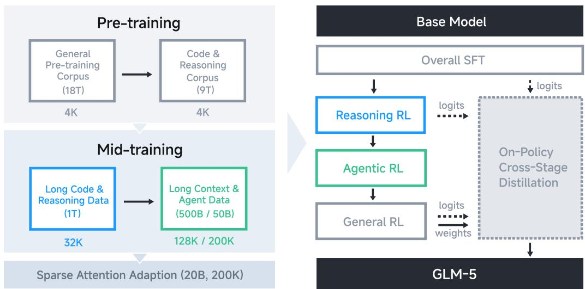

*展示GLM-5从SFT到多阶段RL的完整训练流程，体现了系统性创新*

## 🔬 方法详解
为实现上述目标，GLM-5提出了一套涵盖高效架构与先进训练策略的综合性方法。

**1. 深度寻求稀疏注意力（DSA）**
为了降低标准Transformer自注意力的二次方复杂度，DSA通过为每个token限定一个固定的、较小的可见集合 $\mathcal{S}_i$（大小 $M \ll N$），将计算复杂度从 $O(N^2 \cdot d)$ 降至 $O(N \cdot M \cdot d)$。这模拟了人类关注近期内容和关键信息的认知过程，在保证信息流的同时大幅提升了长序列处理的效率。图6显示了采用DSA后，模型在SFT训练中损失曲线下降更稳定且更快，验证了其有效性。

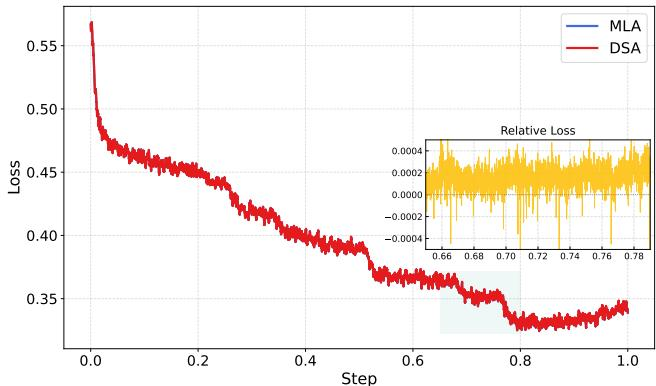

*对比DSA与MLA（推测为某种基线注意力）在SFT训练中的损失曲线，显示DSA更优的收敛性*

**2. 多令牌预测**
为提升模型的前瞻性和推理能力，GLM-5在预训练中采用了多令牌预测目标。其损失函数可概括为：
$$
\mathcal{L}_{\text{multi-token}} = -\frac{1}{T} \sum_{t=1}^{T} \sum_{k=1}^{K} \log P(x_{t+k} | x_{\leq t}; \theta_{\text{shared}}, \theta_k)
$$
其中 $K$ 为预测的未来令牌数。该目标迫使模型在生成当前输出时，隐式地对未来多步进行内部规划，从而学习更强的序列依赖关系。共享主干参数 $\theta_{\text{shared}}$ 保证了效率，而独立的预测头 $\theta_k$ 则允许学习不同步长的特征表示。

**3. 异步智能体强化学习（Asynchronous Agent RL）**
这是GLM-5训练范式的核心创新，旨在解决长周期交互任务中数据收集与模型更新串行进行的效率瓶颈。其核心思想是将轨迹生成（由**行为者策略** $\pi_{\theta’}$ 执行）与参数更新（由**学习者策略** $\pi_{\theta}$ 执行）解耦。

学习者策略的更新基于行为者策略收集的轨迹 $\tau$，并采用重要性采样来校正分布偏差，其策略梯度近似为：
$$
\nabla_\theta J(\theta) \approx \mathbb{E}_{\tau \sim \pi_{\theta’}} \left[ \sum_{t=0}^{T-1} \frac{\pi_\theta(a_t|s_t)}{\pi_{\theta’}(a_t|s_t)} \hat{A}^{\pi_{\theta’}}(s_t, a_t) \nabla_\theta \log \pi_\theta(a_t|s_t) \right]
$$
其中，$\theta’$ 会定期与 $\theta$ 同步。这套异步架构如同建立了一个并行的“实验场”，允许模型进行海量试错，从而高效学习长视野任务中的最优策略。配合新的“交错思考”与“保留思考”机制（如图7所示），进一步优化了长上下文中的规划与执行效率。

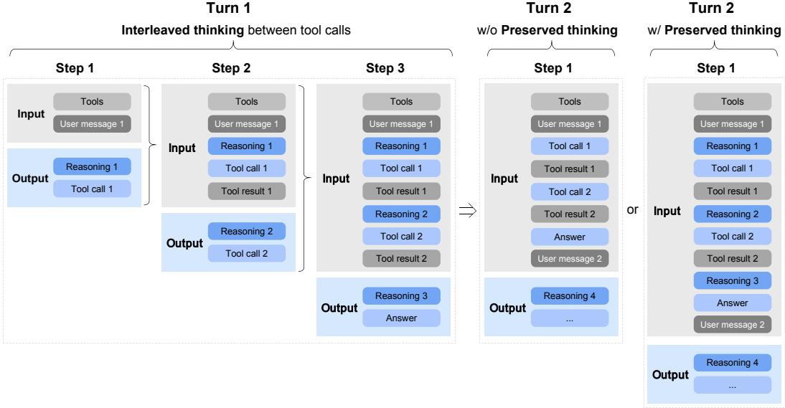

*阐释“交错思考”与“保留思考”机制，优化长上下文任务中的规划流程*

## 📊 实验验证
论文在广泛的基准测试上评估了GLM-5的性能，但其评估的严谨性和透明度存在一定问题。

**主要结果概览**
如图1所示，论文宣称GLM-5在Humanity’s Last Exam、SWE-bench、Terminal-Bench 2.0等8项代理、推理与编码基准上均取得最佳或接近最佳表现，平均性能较GLM-4.7提升约20%，与顶尖闭源模型相当。

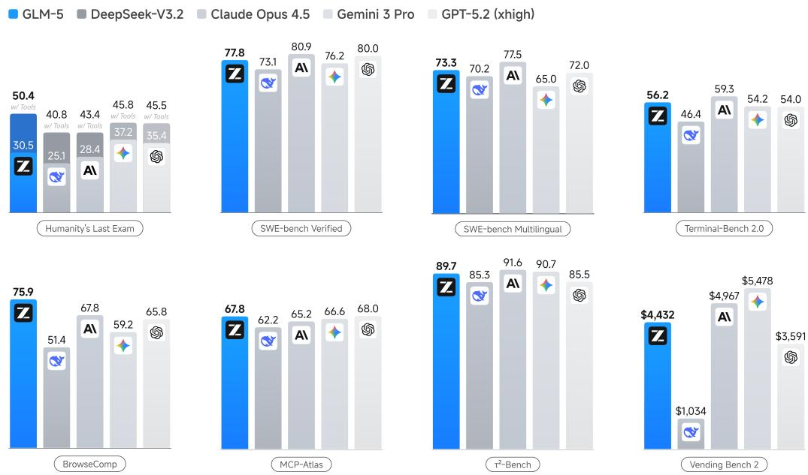

*展示GLM-5与多个基线模型在8项核心基准上的性能对比*

在综合评估指标“人工智能分析指数v4.0”上（图2），GLM-5得分为50分，据称是首个达到此分数的开源模型。论文指出提升主要来自代理性能和知识/幻觉方面的进步。

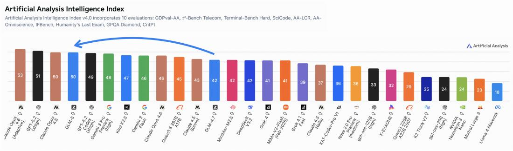

*展示Artificial Analysis Intelligence Index v4.0的构成及GLM-5、GLM-4.7的得分*

**长视野与现实世界能力**
为验证其“智能体工程”能力，论文在更接近真实复杂性的任务上进行了测试。在LMArena的人类评估平台中，GLM-5在代码竞技场排名开源模型第一（图3）。

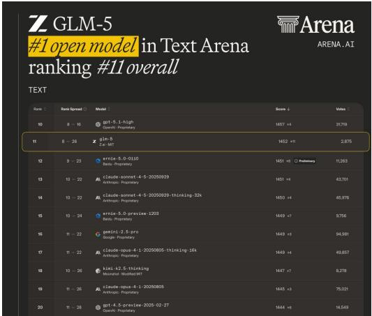

*展示GLM-5在LMArena文本与代码竞技场中的排名情况*

更重要的是，在Vending-Bench 2（模拟长期商业运营）和CC-Bench-V2等长视野任务中，GLM-5表现出强大的战略规划与状态管理能力（图4）。例如，在Vending-Bench 2中最终获得$432的余额，排名开源模型第一。这些结果是支持其“端到端工程能力”声明的有力证据。

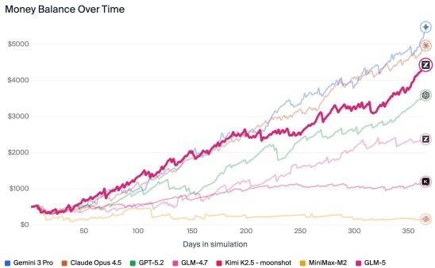

*展示GLM-5在Vending-Bench 2和CC-Bench-V2两个长视野任务上的具体表现*

**可复现性审计**
然而，数据审计员指出了评估中存在的严重问题：
1.  **统计严谨性缺失**：所有性能对比均未提供统计显著性检验、方差或置信区间，改进的可靠性存疑。
2.  **比较基准不透明**：与闭源模型的对比可能未在相同设置（如解码参数、工具使用）下进行。
3.  **效率声称缺乏实证**：尽管论文声称DSA和异步RL带来了显著的效率提升，但未提供任何训练时间、FLOPs或推理速度的量化对比数据。
4.  **复现难度极高**：744B参数的训练需要巨额算力，且论文缺失关键超参数、奖励函数设计及部分核心基准（如CC-Bench-V2）的访问权限。如图8和图9所示，尽管论文探讨了上下文管理策略和奖励破解问题，但整体训练细节仍不透明。

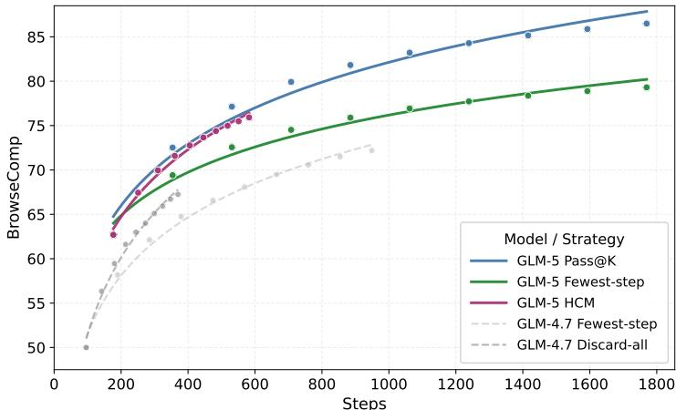

*展示不同上下文管理策略在BrowseComp任务上的准确率*

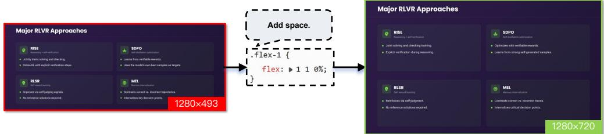

*举例说明RL训练中的奖励破解行为及本文的鲁棒评估方法*

5.  **无消融研究**：论文未量化DSA、异步RL等各个技术组件对最终性能的独立贡献，性能提升归因模糊。

## 💡 核心要点
1.  **范式引领**：GLM-5的工作核心是推动AI从“辅助工具”向“自主工程师”的范式转变，其技术设计均服务于“智能体工程”这一终极目标。
2.  **协同创新**：它成功地将**架构创新（DSA）**、**基础设施创新（异步RL管道）** 与**算法创新（多令牌预测、新RL算法）** 相结合，系统性解决了长上下文成本与长周期学习效率的难题。
3.  **性能标杆**：在现有的大量基准测试和新兴的长视野任务评估中，GLM-5展示了顶尖的综合性能，特别是在需要多步骤决策和状态管理的任务上，为开源社区设立了新的标杆。
4.  **开源意义与局限**：承诺开源巨模型权重是重大贡献，但其极致的规模也揭示了当前AI研究在**可复现性**和**民主化访问**方面的深刻矛盾。论文在科学验证的严谨性上存在不足。

## 🔮 未来方向与局限性
**局限性**：
- **评估的“现实”缺口**：当前基准仍无法完全模拟真实企业级软件开发的复杂性（如模糊需求、人际沟通）。
- **声明的验证缺口**：效率提升、组件贡献等关键声明缺乏坚实的量化数据支持。
- **应用的可行性缺口**：744B参数的巨型模型对大多数开发者而言难以微调或部署，实用化依赖蒸馏版本或API服务。

**未来方向**：
1.  **评估体系革新**：需要建立更能体现“端到端”复杂性、包含动态环境与多人协作的新型评估基准。
2.  **训练科学化**：在追求规模与性能的同时，必须加强实验的统计严谨性、提供详细的消融分析与效率报告。
3.  **效率与可及性**：持续优化模型架构与推理技术，并积极发展模型压缩、蒸馏技术，使尖端能力能够惠及更广泛的研究者和应用开发者。
4.  **安全与对齐**：随着自主能力的增强，如何确保智能体行为的安全、可靠、符合人类意图，将是下一个关键挑战。图10和图11所示的“智能体即法官”评估框架和对通用能力的保持，正是朝着这个方向的重要探索。

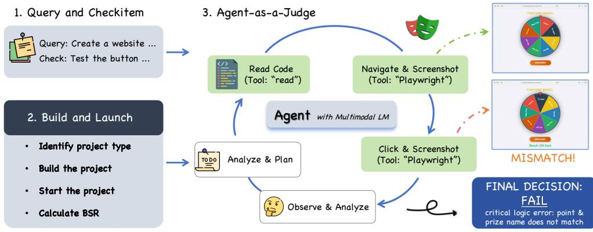

*展示“智能体即法官”的评估流程，用于验证生成代码的功能正确性*

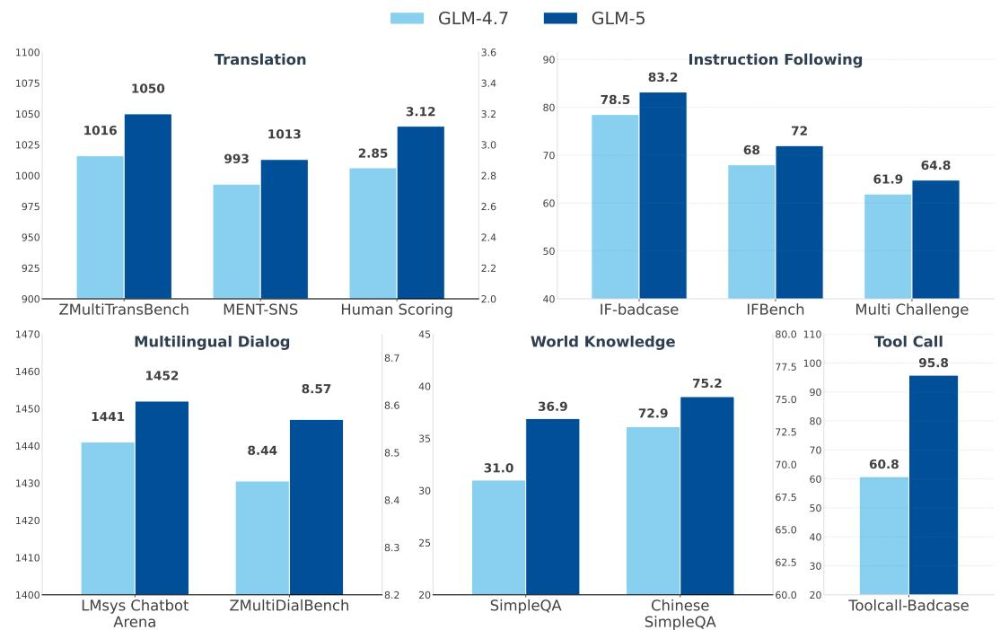

*对比GLM-4.7与GLM-5在五个现实世界通用能力领域上的表现*
