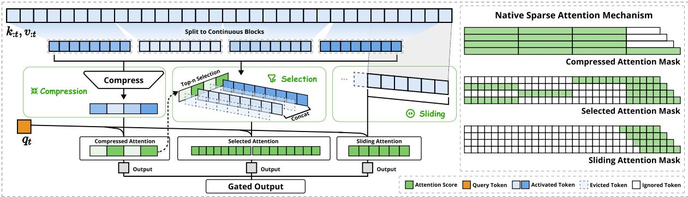
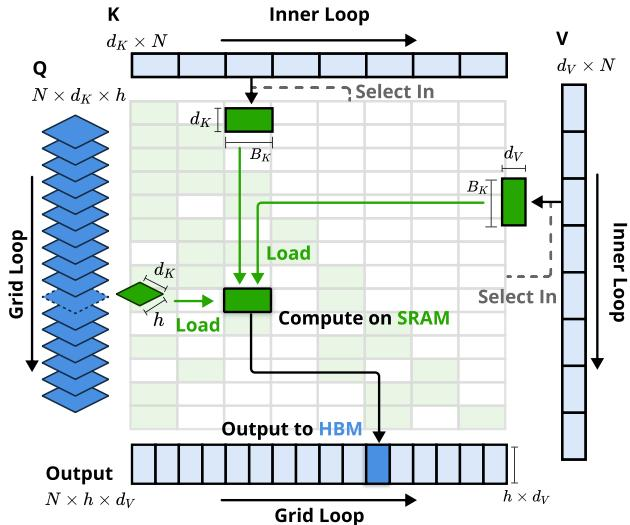
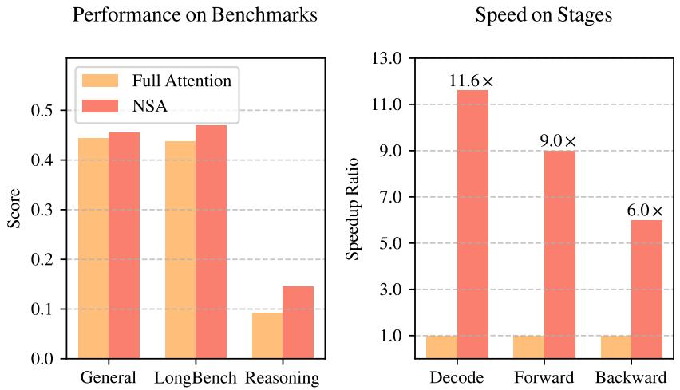
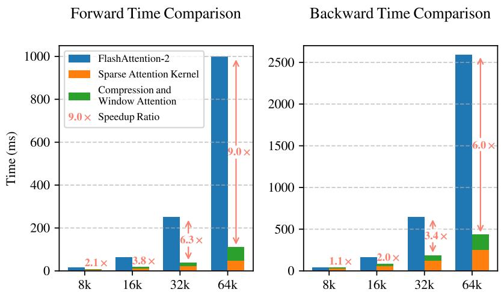
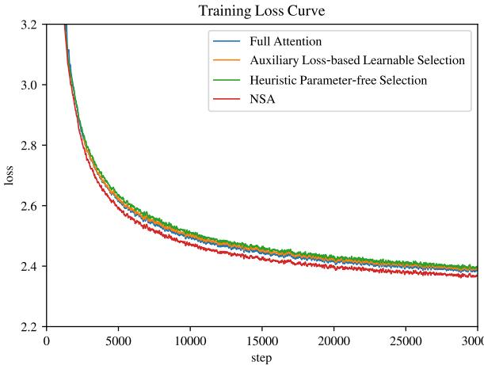
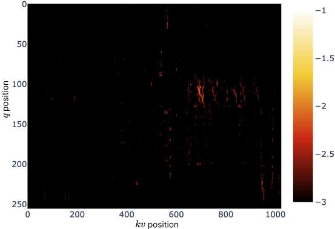

# 📄 Native Sparse Attention: Hardware-Aligned and Natively Trainable Sparse Attention

# Natively Sparse Attention (NSA)：弥合理论效率与硬件效率鸿沟的分析报告

## 概要（TL;DR）
- **核心问题**：论文旨在解决高效长上下文建模中，稀疏注意力机制**理论计算节省**（FLOPs降低）与**实际硬件加速效果**（延迟降低）及**端到端可训练性**严重脱节的痛点。
- **创新方法**：提出**原生可训练分层稀疏注意力（NSA）**，其并非事后“嫁接”的加速插件，而是将稀疏性作为底层设计原则，通过**压缩、选择、滑动窗口**三阶段实现硬件友好的线性复杂度计算。
- **关键结果**：
    - **性能**：在多个长上下文基准（如LongBench）上，NSA在相同稀疏度下**超越了全注意力基线及其他推理期稀疏方法**，并在部分推理任务上表现更优。
    - **效率**：针对64K长序列，NSA实现了高达**11.6倍的理论加速比**，并通过专用内核设计在解码和前/反向传播阶段均获得显著实际加速。
- **主要争议**：实验部分在**统计显著性检验、基线对比完整性**（尤其在推理任务上）以及**关键复现细节**（如代码、数据、训练超参）的披露上存在不足，影响了其结论的坚实度和工作的可复现性。

## 📚 研究背景与动机
长上下文建模是下一代大语言模型的关键能力，支撑着从深度推理到多轮智能体等复杂应用。然而，标准Transformer中的全注意力（Full Attention）机制因其与序列长度的二次方复杂度（O(n²)），成为处理长序列时的核心瓶颈。

为解决此问题，一个自然的思路是利用注意力得分的**内在稀疏性**，即并非所有查询-键交互都同等重要。大量研究探索了通过选择性计算关键交互来减少开销的“稀疏注意力”方法。然而，论文揭示了一个深层的核心矛盾：尽管这些方法报告了可观的理论计算节省，但这些节省**往往无法转化为实际部署中显著的端到端速度提升**，尤其在训练阶段几乎未被有效利用。

因此，本文的深层动机在于弥合“理论效率”与“实际硬件效率及可训练性”之间的鸿沟。论文批判了现有主流方法的三大局限：
1.  **“推理后嫁接”的架构偏差**：多数方法是在预训练好的全注意力模型上，于推理阶段附加稀疏化策略，导致稀疏模式可能非最优且无法通过训练优化。
2.  **硬件不友好的“纸面加速”**：算法设计未充分考虑GPU等硬件特性，不规则的内存访问和额外调度开销使得理论FLOPs减少无法兑现为实际延迟降低。
3.  **训练支持的缺失**：缺乏高效稳定的训练时稀疏注意力算子，导致“稀疏性”仅是一个推理技巧，而非模型可学习的内在能力。

基于此，论文提出了 **“原生稀疏性（Native Sparsity）”** 的核心见解，旨在构建一个从算法到硬件协同设计、并从训练阶段就原生支持稀疏性的注意力架构。

## 🔬 方法详解
为应对上述挑战，论文提出了 **分层稀疏注意力（NSA）** 。其核心思想是通过一个层次化、硬件友好的流程，动态选择关键Token进行注意力计算，从而实现从训练到推理的全流程高效。




*NSA整体架构概览，展示其由压缩、选择、滑动窗口三个并行注意力分支组成的处理流程。*


NSA的完整流程包含三个协同的算法组件，其数据处理流与变量依赖关系如下图所示：

```mermaid
flowchart TD
    A["输入序列 X<br>(T×d)"] --> B[“阶段一：Token压缩<br>（平均池化，比率 r）”]
    B --> C[“压缩序列 Xc<br>(C×d, C=T/r)”]
    A --> D[“阶段二：Token选择<br>（核匹配评分 S(xt)）”]
    C --> D
    D --> E[“Top-k 关键Token<br>X_topk (k×d)”]
    C --> F[“阶段三：序列合并<br>Z = Concat(Xc， X_topk)”]
    E --> F
    F --> G[“最终序列 Z<br>(L×d, L=C+k)”]
    G --> H[“滑动窗口注意力<br>（窗口半径 w， 线性复杂度）”]
```

#### 1. Token压缩：降低计算基线
首先，NSA对输入序列 $\mathbf{X} \in \mathbb{R}^{T \times d}$ 进行不重叠的平均池化，将序列长度从 $T$ 压缩至 $C = \lfloor T/r \rfloor$，得到压缩表示 $\mathbf{X}^c$。这类似于图像处理中的下采样，旨在聚合局部信息，形成代表整个序列“概要”的超级Token，为后续步骤建立一个更短的计算基线。

#### 2. Token选择：动态找回关键细节
为避免池化操作平滑掉重要细节，NSA设计了一个轻量化的**核匹配评分机制**，用于从原始序列中动态筛选关键Token。对于每个原始Token $\mathbf{x}_t$，其重要性分数 $S(\mathbf{x}_t)$ 通过计算其与所有压缩Token $\mathbf{x}^c_c$ 的余弦相似度并取最大值得到：
$$
S(\mathbf{x}_t) = \max_{c} \left( \frac{\mathbf{x}_t \cdot \mathbf{x}^c_c}{\|\mathbf{x}_t\| \|\mathbf{x}^c_c\|} \right)
$$
该分数衡量了原始Token与序列“最佳代表点”的相似度。随后，选择分数最高的 $k$ 个Token（记为 $\mathbf{X}^{\text{top-k}}$）作为需要保留的精细信息。

#### 3. 滑动窗口注意力：高效的局部交互
最后，将压缩序列 $\mathbf{X}^c$ 与选出的关键序列 $\mathbf{X}^{\text{top-k}}$ 合并，构成最终的注意力输入序列 $\mathbf{Z} \in \mathbb{R}^{L \times d}$（$L = C + k$）。在 $\mathbf{Z}$ 上，NSA应用**滑动窗口注意力**：每个Token仅与其前后 $w$ 个邻居Token进行注意力计算。其输出 $\mathbf{o}_i$ 计算如下：
$$
\mathbf{o}_i = \sum_{j \in \mathcal{N}(i)} \frac{\exp(\mathbf{q}_i \cdot \mathbf{k}_j / \sqrt{d})}{\sum_{j‘ \in \mathcal{N}(i)} \exp(\mathbf{q}_i \cdot \mathbf{k}_{j’} / \sqrt{d})} \mathbf{v}_j, \quad \mathcal{N}(i) = \{j \mid |i-j| \le w\}
$$
由于窗口大小 $w$ 是常数，该步骤的复杂度为 $O(Ld)$，即**线性于序列长度**。

#### 🏗️ 硬件协同的核函数设计
为实现理论效率到实际速度的转化，NSA专门设计了高性能计算内核。其核心优化在于**提高算术强度**（每次内存访问执行的浮点运算数）。
- **传统方式**：需要多次读写全局内存来计算和保存中间注意力矩阵。
- **NSA优化内核**：采用融合内核技术，将查询向量一次加载至快速共享内存（SRAM），然后在滑动窗口内批量处理键值对，在寄存器中完成注意力权重的计算与加权求和，极大减少了耗时的全局内存访问。




*NSA内核设计示意图，展示其如何通过Grid Loop和Inner Loop在SRAM上高效组织计算，减少对HBM的访问。*


## 📊 实验验证
论文在通用能力、长上下文理解及数学推理等多个维度上对NSA进行了评估，并将其与全注意力（Full Attention）及主流推理期稀疏化方法（如H2O, InfLLM）进行对比。

### 性能表现分析
**在通用基准（如MMLU, GSM8K）上**，NSA与全注意力模型表现相当，平均性能略有提升（+0.013），但在代码生成任务（MBPP）上出现下降。这初步表明原生稀疏设计未对模型通用能力造成显著损害。

**在长上下文任务（LongBench）上**，NSA展现出更明确的优势。在控制稀疏度相同的条件下，NSA的平均得分超越了包括全注意力在内的所有基线。




*综合展示NSA在通用基准、长上下文任务和推理评估中相对全注意力的平均性能对比。*


**在链式思维推理（AIME）上**，经过指令微调的NSA模型性能显著优于同条件下的全注意力模型。然而，**实验审计指出一个关键缺陷**：此处缺少与其他同样可用于推理的稀疏注意力基线的直接对比，因此NSA“原生可训练”特性在该任务上的独特价值论证尚不充分。

### 效率收益验证
效率是NSA的核心主张。论文分析显示，随着序列长度增长，NSA所需计算和访问的Token数远低于全注意力，在64K长度下实现了约91.4%的稀疏度，理论加速比达11.6倍。

更重要的是，通过专用的Triton内核实现，NSA在实际硬件上获得了显著的端到端速度提升。



*NSA的Triton内核与FlashAttention-2内核的延迟对比，显示NSA在所有序列长度上延迟更低，且优势随长度增加而扩大。*


*展示在处理64K序列时，NSA在解码、前向传播和反向传播三个阶段均获得大幅计算加速。*


### 消融研究与动机可视化
- **消融实验**：对比了NSA与其它Token选择策略（如基于辅助损失、启发式方法）的训练损失曲线，验证了其设计的有效性。
  


*不同Token选择策略的训练损失对比，显示NSA策略收敛效果更佳。*

- **设计动机**：通过可视化全注意力模型的注意力图，揭示了注意力分数呈“块状聚类”分布的现象，为NSA采用分块压缩与选择的策略提供了直观依据。
  


*全注意力模型注意力图的可视化，图中亮色区域显示注意力确实存在块状聚类分布。*


### ⚠️ 实验局限与复现风险（审计员观点）
尽管结果积极，但独立审计揭示了以下几个关键问题：
1.  **统计严谨性不足**：所有性能表格均未报告方差或置信区间，无法判断改进的统计显著性。
2.  **基线对比不完整**：在推理任务（AIME）和部分长上下文对比中，缺失与主流稀疏方法（如InfLLM， Quest）的直接比较，削弱了论证力度。
3.  **复现信息严重缺失**：**论文未提供代码、模型权重或详细预训练数据配方**，且缺少批量大小、学习率等关键训练超参数，复现风险极高。
4.  **效率数据有待补充**：虽有关键核加速数据，但缺乏端到端训练迭代时间或系统级吞吐量的全面对比。

## 💡 核心要点
1.  **真问题，新思路**：NSA精准命中了当前稀疏注意力研究“重理论、轻实践”的痛点，开创性地提出“原生稀疏性”设计原则，旨在弥合理论效率与硬件效率的鸿沟。
2.  **算法与硬件协同设计**：其分层（压缩-选择-滑动窗口）方法不仅在算法上实现了线性复杂度，更通过精心设计的核函数与GPU内存层次结构对齐，将理论FLOPs节省切实转化为延迟降低。
3.  **全流程优势初显**：实验表明，一个为稀疏而生的架构能够在不损害（甚至略微提升）模型能力的前提下，实现从训练到推理的全程加速，证明了“原生可训练稀疏注意力”的可行性。
4.  **论证与开放度有待加强**：工作的影响力目前受到实验论证严谨性不足和缺乏开源资源的限制。其宣称的优势需要更透明、更完整的评估来充分支撑。

## 🔮 未来方向与局限性
基于当前分析，NSA的未来发展与改进可能围绕以下几点：
- **加强实验论证**：未来工作需补充统计显著性检验，并在所有任务上进行更全面的基线对比，尤其是与那些在推理阶段可应用于微调后模型的稀疏方法。
- **提升开源性与可复现性**：公开模型代码、权重及详尽的数据处理与训练脚本，是让社区接受并推进该项研究的关键一步。
- **探索更优稀疏模式**：当前基于池化和固定窗口的稀疏模式是有效的，但未必最优。可探索学习动态的、内容感知的稀疏连接模式。
- **扩展到更复杂场景**：验证NSA在极长序列（>100万Token）、多模态长上下文等更复杂场景下的有效性与效率。

**局限性**：NSA的性能增益在部分任务上尚不显著或一致；其设计依赖于序列的局部性和可压缩性假设，在处理极度非局部依赖的任务时可能面临挑战；此外，复杂的多阶段流程可能引入额外的实现与调试成本。