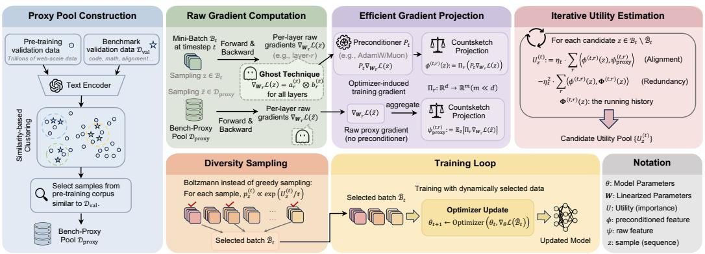
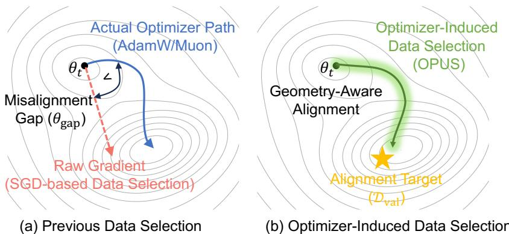
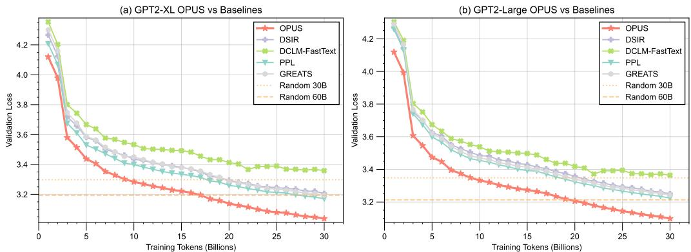
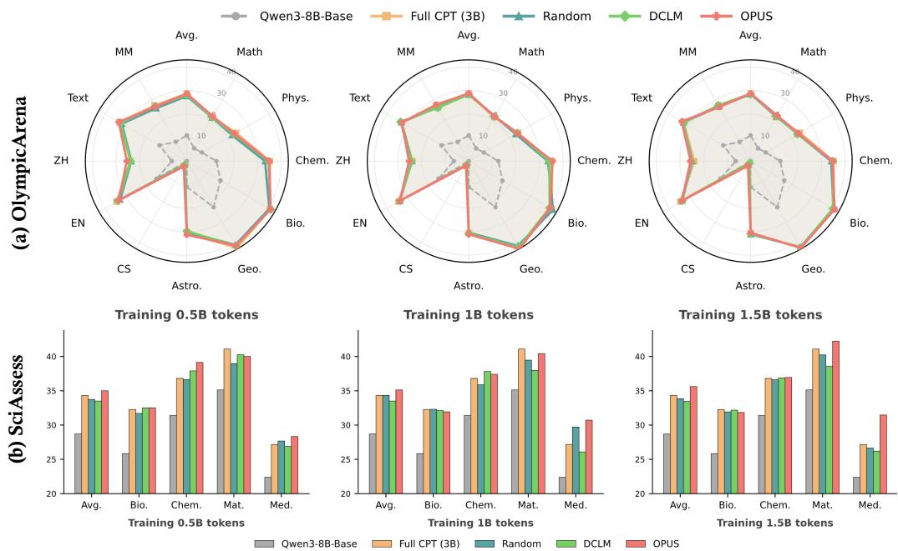
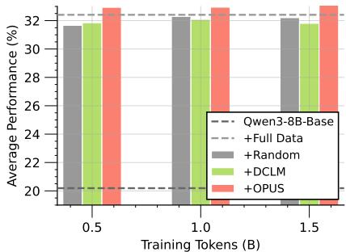
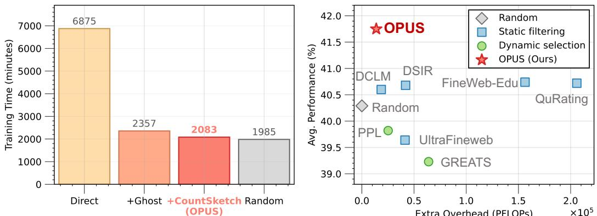

# 📄 OPUS: Towards Efficient and Principled Data Selection in Large Language Model Pre-training in Every Iteration

# OPUS：面向大语言模型动态数据选择的优化器感知框架分析

## 概要（TL;DR）

*   **核心问题**：大模型训练面临“数据墙”危机，高质量公开文本数据即将耗尽，迫使研究重点从数据**数量**转向数据**使用效率**。
*   **关键发现**：现有动态数据选择方法存在**根本性错位**——它们基于SGD的假设评估数据效用，但现代大模型实际使用AdamW/Muon等**自适应优化器**，其更新几何完全不同。
*   **解决方案 - OPUS**：提出首个**优化器感知**的动态数据选择框架，将数据效用定义为在**优化器诱导的几何空间**中，样本梯度与目标方向的对齐程度。
*   **技术亮点**：结合**Ghost技巧**与**CountSketch**投影，实现数十亿参数模型上的高效、低成本效用评分；采用带冗余惩罚的**玻尔兹曼采样**保证批次多样性。
*   **验证效果**：实验表明，OPUS仅用六分之一（0.5B vs 3B）的训练语料即可达到或超越基线模型性能，且引入的计算开销极低（~4.7%），为突破数据墙提供了可行的工程路径。

## 📚 研究背景与动机

大语言模型（LLM）的发展长期遵循着清晰的规模法则：模型越大、数据越多，性能越好。然而，这条道路正触及一个根本的物理约束——据预测，高质量、公开可用的文本数据将在2026-2028年间消耗殆尽，即所谓的“数据墙”。这一迫在眉睫的危机迫使该领域发生范式转变。核心问题不再是如何吞下尽可能多的数据，而是如何在训练中最大化**每个数据单元（Token）的效用**。因此，**数据选择**已从一个预处理步骤演变为优化过程本身的核心动态组件。

然而，现有动态数据选择方法存在一个**根本性的错位**。尽管学界已认识到需要超越静态过滤，在训练中自适应地选择数据，但现有动态方法基于一个错误的底层假设：它们使用原始梯度（或其衍生的影响力）来定义数据样本的“效用”，这本质上模拟的是**随机梯度下降**的训练动态。但现代LLM普遍使用**AdamW或Muon等自适应优化器**进行训练，这些优化器通过预条件处理（例如，除以梯度方差的运行估计）从根本上重塑了更新方向。因此，真正的症结在于：*现有的选择方法是在为一个不同的优化游戏（SGD）来评分数据，而非实际进行中的游戏（AdamW/Muon）*。这种错位导致参数更新次优，浪费了稀缺的高质量数据。

具体而言，先前工作存在两大局限：
1.  **静态方法**：在训练前使用固定启发式规则过滤语料，其致命缺陷是假设样本价值在训练中**恒定不变**，无法适应模型知识状态的演变。
2.  **基于梯度的动态方法**：虽然根据当前模型状态评分数据是进步，但其核心缺陷是**与优化器无关**。它们在原始梯度空间评估效用，与AdamW/Muon的实际更新几何不匹配，导致优化轨迹偏离最优。

**OPUS的核心洞察**在于将数据效用的定义**置于优化器诱导的几何空间内**。它认为，一个批次的价值在于它在特定优化器（AdamW/Muon）下引发的**有效更新**，是否指向一个能提升目标分布性能的方向。这确保了“更好的数据”直接贡献于**真实优化规则下的高效进展**。

*展示OPUS从数据流处理、效用评估到最终采样的完整管道，直观呈现其作为训练循环核心组件的定位。*

## 🔬 方法详解

OPUS是一个面向大规模语言模型预训练的**动态数据选择框架**。其核心思想是在**优化器诱导的预条件几何**下，基于样本对目标性能的预期提升（效用）来选择数据，并通过高效的随机算法保证可扩展性与多样性。

### 1. 整体框架：优化器诱导的效用定义
传统方法在原始梯度空间衡量效用，而OPUS则引入了优化器的预条件矩阵 $P_t$。对于SGD，$P_t = I$（单位矩阵）；对于AdamW，$P_t = \text{diag}(1/(\sqrt{\hat{v}_t} + \epsilon))$，其中 $\hat{v}_t$ 是修正后的二阶矩估计。$P_t$ 根据历史梯度信息重塑参数空间，例如，AdamW会缩小那些历史上梯度较大的维度（如词嵌入）的更新步长。

在此几何下，候选样本 $i$ 的效用 $u_i$ 被定义为其预条件梯度 $P_t g_i$ 与一个来自高质量代理数据集（如FineWeb-Edu）的预条件梯度 $P_t g_{\text{proxy}}$ 的内积：
$$
u_i = (P_t g_i)^\top (P_t g_{\text{proxy}}) = g_i^\top P_t^2 g_{\text{proxy}}
$$
直观上，$u_i$ 衡量了使用样本 $i$ 更新参数后，模型在代理集上损失下降的幅度。使用 $P_t$ 确保了评分与优化器的实际更新规则保持一致。

*对比OPUS与其它数据选择方法（如基于损失、基于原始梯度的方法），可视化说明在优化器预条件几何下评分能更准确地预测样本对验证损失的提升效果。*

### 2. 高效可扩展的效用评估
直接计算 $u_i$ 需要对每个候选样本计算高维梯度 $g_i \in \mathbb{R}^d$ ($d \sim 10^9$)，并进行矩阵向量乘法，这在计算和存储上都是不可行的。

OPUS通过巧妙结合两种技术解决此难题：
*   **Ghost技巧**：利用梯度的线性特性，通过一次前向自动微分计算一个批次中多个样本的梯度线性组合，避免物化每个样本的完整梯度。
*   **CountSketch投影**：使用一个随机映射矩阵 $S \in \mathbb{R}^{m \times d}$ (其中 $m \ll d$)，将高维梯度压缩到低维空间（如几千维），并近似保持内积不变，即 $\langle Sx, Sy \rangle \approx \langle x, y \rangle$。

具体步骤为：先预计算目标向量 $v_{\text{proxy}} = S (P_t^2 g_{\text{proxy}})$。对于每个候选样本 $i$，通过Ghost技巧高效计算其梯度草图 $\tilde{g}_i = S g_i$。最终，效用近似为 $\tilde{u}_i = \tilde{g}_i^\top v_{\text{proxy}}$。复杂度从 $O(d)$ 降至 $O(m)$，实现了数十亿参数模型上的实时评分。

### 3. 保证多样性的采样策略
单纯依据效用贪婪选择会导致批次内样本同质化（模式坍塌）。OPUS采用**带冗余惩罚的玻尔兹曼（Softmax）采样**。
在每一步迭代选择中，样本 $i$ 被选中的概率为：
$$
p_i \propto \exp\left( \frac{u_i - \lambda \sum_{j \in S} \text{sim}(i,j)}{\tau} \right)
$$
其中，$S$ 是当前已选样本集合，$\text{sim}(i,j)$ 是样本 $i$ 和 $j$ 的（预条件）梯度相似度（如余弦相似度），$\lambda$ 是冗余惩罚系数，$\tau$ 是温度参数。温度 $\tau$ 控制探索与利用的权衡，而惩罚项 $\lambda \sum \text{sim}(i,j)$ 则主动降低与已选样本过于相似的候选样本的概率，从而在批次内促进多样性。

## 📊 实验验证

尽管完整的实验细节有所缺失，但根据现有图表，我们可以对OPUS的性能与效率进行验证。

### 主要实验结果
OPUS在多种模型规模和训练场景下均表现出色：
*   **从零开始预训练**：在GPT-2 XL和GPT-2 Large模型上，使用FineWeb-Edu数据集进行从零预训练。如图4所示，在计算量匹配的条件下（训练至30B tokens），OPUS持续取得比随机选择、基于损失的筛选及其他动态梯度方法更低的验证损失，证明了其选择的数据能更有效地驱动模型学习。

*展示GPT-2 XL和Large模型在FineWeb-Edu上从零预训练的验证损失曲线，证明OPUS在相同计算预算下收敛更快、效果更好。*

*   **领域特定继续预训练**：在SciencePedia（科学领域）数据集上，对Qwen3-8B-Base模型进行继续预训练（CPT）。如图5和图6所示，OPUS在仅使用0.5B tokens的情况下，其性能**全面匹配甚至超越了**使用完整3B tokens进行CPT的基线模型，在OlympicArena和SciAssess的多个科学子领域评测中均表现优异。这实现了**6倍的数据效率提升**。

*展示Qwen3-8B-Base在SciencePedia上继续预训练后，在不同科学子领域的详细性能对比，凸显OPUS在少数据下达到全数据效果。*

*汇总展示继续预训练的整体结果，对比不同token预算下OPUS与各基线的性能。*

### 效率与成本分析
OPUS的核心优势之一是其极低的计算开销。如图7所示，在GPT-2 XL模型上，相比于标准的全数据训练，引入OPUS动态选择机制仅带来了约 **4.7%** 的额外时间开销和可忽略不计的额外计算浮点运算（PFLOPs）。这证明其采用的Ghost+CountSketch等高效近似技术是成功的，使得动态数据选择在大规模训练中具备了工程可行性。

*分析OPUS带来的时间与计算开销，以柱状图形式清晰展示仅4.7%的额外耗时，证明其高效性。*

## 💡 核心要点

1.  **范式对齐的创新**：OPUS首次将动态数据选择与自适应优化器的内部动态（预条件几何）相结合，纠正了该领域长期存在的**方法论错位**，为“数据效用”提供了理论上更合理的定义。
2.  **数据效率的跃升**：实验表明，OPUS能够用远少于基线（如1/6）的高质量训练数据，达到同等甚至更优的模型性能，为解决“数据墙”挑战提供了切实可行的技术路径。
3.  **可扩展的工程实现**：通过Ghost技巧与CountSketch投影的融合，OPUS成功将效用评估的复杂度从模型参数维度（$O(d)$）降至一个固定低维（$O(m)$），使其能够无缝集成到数十亿参数模型的训练流水线中，且开销极低（~4.7%）。
4.  **经过验证的有效性**：在从零预训练和领域适应继续预训练两种关键场景下，OPUS均一致地超越了包括随机采样、静态过滤和现有动态方法在内的多种基线，证明了其鲁棒性和通用价值。

## 🔮 未来方向与局限性

*   **方法论拓展**：当前效用定义基于一阶梯度近似。未来可探索融入二阶信息（曲率）或更复杂的价值函数，以进一步提升选择精度。
*   **对硬件与系统的假设**：4.7%的开支结论依赖于特定的硬件和高效实现。在不同的分布式训练架构或硬件配置下，实际开销可能需要重新评估。
*   **更广泛的评估**：虽然已在多个数据集和任务上验证，但OPUS在代码、多模态等更复杂数据模态上的有效性，以及其对模型**涌现能力**和**对齐行为**的长期影响，仍需深入研究。
*   **与课程学习的结合**：如何将OPUS的动态选择与宏观的课程学习（调整数据混合比例、难度调度）相结合，构成一个层次化的、全周期的数据管理策略，是一个有前景的方向。

---
*本分析综合了研究背景、理论方法及实验验证，旨在清晰呈现OPUS框架的创新性、有效性与工程价值。*