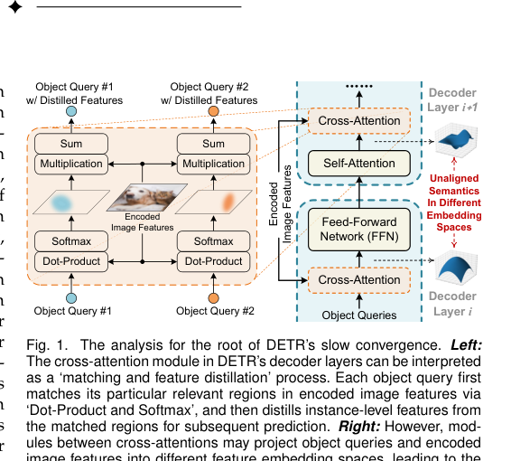
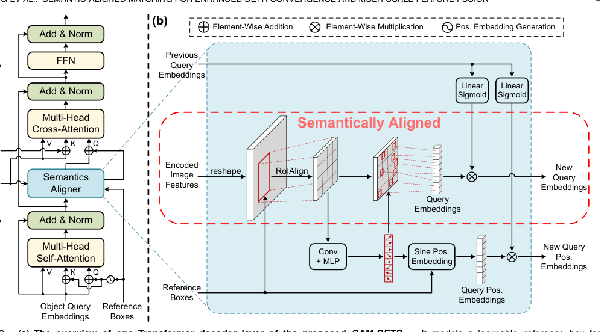
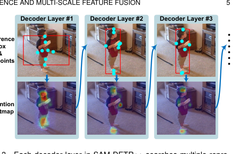
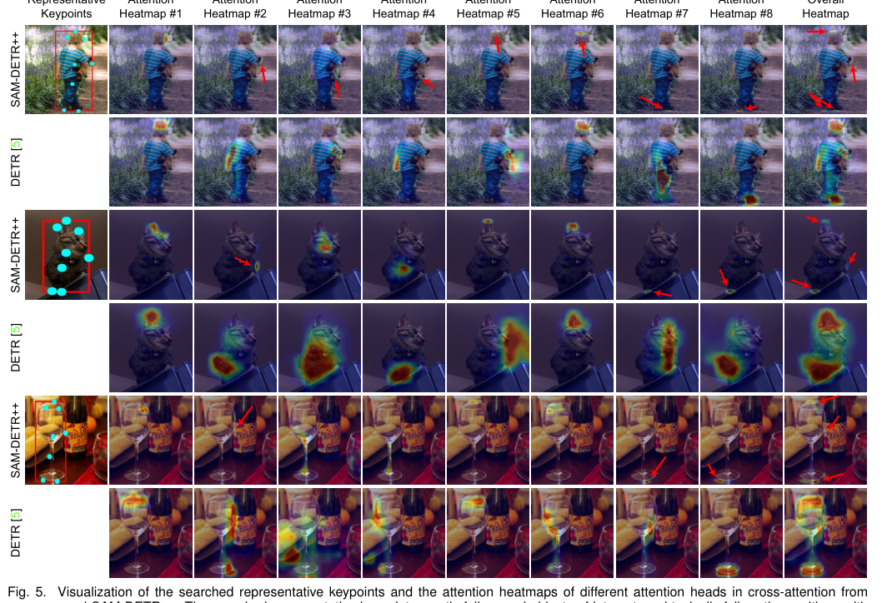
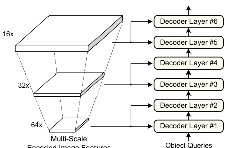
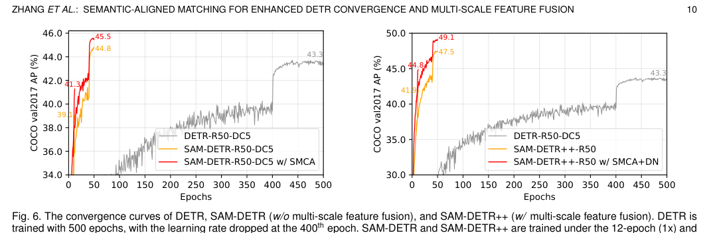

# 📄 ZHANG ET AL.: SEMANTIC-ALIGNED MATCHING FOR ENHANCED DETR CONVERGENCE AND MULTI-SCALE FEATURE FUSION

# [论文标题分析] SAM-DETR++：通过语义对齐匹配加速 DETR 收敛

## 概要（TL;DR）
-   **核心问题**：DETR 训练收敛慢的根本原因是对象查询（Query）与图像特征（Feature）之间的**语义未对齐**，导致注意力匹配在初始化时无效。
-   **核心方案**：提出 **SAM-DETR++**，核心是一个 **“语义对齐器”（Semantics Aligner）** 模块。它在交叉注意力前，将对象查询重新采样到与图像特征相同的语义空间，使匹配过程立即可行。
-   **关键结果**：仅用 **12 个训练周期**即达到 **44.8% AP**，性能优于训练 500 周期的 DETR (43.3%)，**收敛速度提升超过 97%**，并创下基于 ResNet-50 的 Transformer 检测器新 SOTA (49.1% AP @ 50 周期)。
-   **关键优势**：方法为**即插即用**，与现有收敛加速方案（如 SMCA、DN-DETR）互补，并能无缝扩展到**多尺度特征融合**。

## 📚 研究背景与动机
物体检测是计算机视觉的核心任务。传统基于卷积神经网络（CNN）的检测器（如 Faster R-CNN、YOLO）依赖人工设计的锚框（anchor）和非极大值抑制（NMS），流程复杂。DETR（Detection Transformer）的出现带来了变革，它提供了首个完全端到端的 Transformer 检测框架，消除了这些手动设计。然而，DETR 的广泛应用受到一个关键缺陷的阻碍：**训练收敛极慢**，需要多达 500 个训练周期才能达到 CNN 检测器仅用 12-36 周期即可获得的性能，这大大增加了计算成本。

*展示 DETR 解码器中，对象查询与图像特征因经过不同模块处理而投影到语义未对齐的嵌入空间，导致匹配困难。*

研究发现，缓慢收敛的表象之下，**根本原因在于解码器中对象查询与图像特征之间的“匹配过程”困难**。交叉注意力本质是一个“匹配与特征蒸馏”过程。然而，在解码器各层之间，对象查询和编码后的图像特征被投影到了**不同且语义未对齐的嵌入空间**。这种错位意味着在初始化时，注意力机制所依赖的点积相似度计算是无效的——每个查询同等地关注所有图像位置。模型因此必须在训练过程中**费力地从零开始学习对齐这些空间**，这正是巨大收敛延迟的主要驱动力。

现有加速 DETR 的工作大多治标不治本，未能触及这一核心原因：**空间约束方法**（如 Deformable DETR）缩小了搜索范围，但未确保被比较特征的语义可比性；**训练策略改进**（如 DN-DETR）使优化目标更清晰，但未简化基础的相似度计算；**多尺度特征融合**则因不同尺度间固有的语义未对齐问题而受阻。

**本文的关键洞察**来源于孪生网络（Siamese Network）架构。在目标跟踪、重识别等匹配任务中，将两个输入投影到一个**共享的、语义对齐的嵌入空间**是进行高效、准确相似度计算的前提。作者认识到，DETR 的交叉注意力本质上就是一个**基于相似度的匹配任务**。因此，快速收敛的关键不在于设计更复杂的注意力机制，而在于确保在点积操作*之前*，对象查询和图像特征就位于**相同的语义空间**中。这使得相似度度量从一开始就有意义，为模型提供了强大的先验，引导每个查询立即关注具有相似语义的区域。

## 🔬 方法详解
SAM-DETR++ 的核心是引入一个即插即用的 **“语义对齐器”** 模块，置于每个解码器层的交叉注意力操作之前。其核心思想是：**在匹配发生前强制对齐语义**。

*(a) SAM-DETR++ 解码器层概览，展示了语义对齐器的插入位置；(b) 语义对齐器模块的详细架构，包括 RoIAlign、关键点预测和特征重加权。*

### 🔍 核心操作：从重采样到语义对齐
标准 DETR 的交叉注意力可阐释为匹配与蒸馏：
$$
Q' = \underbrace{\text{Softmax}\left(\frac{(QW_q)(FW_k)^T}{\sqrt{d}}\right)}_{\text{匹配相关区域}} \underbrace{(FW_v)}_{\text{从相关区域蒸馏特征}}
$$
其中 $Q$ 是对象查询，$F$ 是图像特征。问题在于 $Q$ 和 $F$ 的语义空间不同，导致初始匹配低效。

SAM-DETR++ 的解决方案是重采样查询：
1.  **提取区域特征**：基于每个查询对应的预测参考框 $R_{box}$，通过 RoIAlign 从图像特征图 $F$ 中提取区域特征 $F_R$。
    $$
    F_R = \text{RoIAlign}(F, R_{box}) \quad \text{(Eq. 2)}
    $$
2.  **搜索代表性关键点**：通过一个轻量级网络（ConvNet+MLP）预测 $M$ 个最具区分性的关键点在 $R_{box}$ 内的相对坐标 $R_{SP}$。
    $$
    R_{SP} = \text{MLP}(\text{ConvNet}(F_R)) \quad \text{(Eq. 4)}
    $$
3.  **采样对齐特征**：在 $F_R$ 中根据 $R_{SP}$ 的坐标，通过双线性插值采样得到 $M$ 个特征向量，并将其拼接为新的查询嵌入 $Q^{new‘}$。
    $$
    Q^{new'} = \text{Concat}(\{F_R[..., x, y, ...] \text{ for } x, y \in R_{SP}\}) \quad \text{(Eq. 5)}
    $$
    

*可视化解码过程中，代表性关键点（青色点）如何逐渐落在物体上有意义的位置，注意力热图也随之变得更精确。*

4.  **特征重加权**：保留原始查询 $Q$ 所携带的高层“检测意图”，通过一个由 $Q$ 生成的 Sigmoid 门控掩码对采样得到的新特征 $Q^{new‘}$ 进行调制，得到最终的对齐查询 $Q^{new}$。
    $$
    Q^{new} = Q^{new'} \otimes \sigma(Q W_{RW1}) \quad \text{(Eq. 7)}
    $$

*可视化代表性关键点位置及各注意力头的热图，显示关键点落在物体显著部位（如边界、中心），热图高度聚焦。*

**物理直觉**：与其让一个抽象的“检测代理”（原始查询 $Q$）在整张图像中艰难地寻找自己，我们先将它“放置”到图像中的一个具体区域（$R_{box}$），并用该区域最具代表性的视觉特征（$Q^{new}$）来重新定义它。当这个新代理再去和图像计算相似度时，它自然会在其来源区域找到最高相似度，因为二者现在由相同的“视觉材料”构成。这绕过了从零学习对齐不同语义空间的难题。

### 🏗️ 扩展到多尺度特征融合
语义对齐机制使得高效的多尺度特征融合成为可能。如 

*展示 SAM-DETR++ 如何以由粗到精的方式，将不同尺度的特征图输入不同的解码器层。*
 所示，不同分辨率的特征图（如来自 FPN）被输入到不同的解码器层。没有语义对齐时，查询需要在每个尺度变化时重新对齐语义，增加复杂性。而有了语义对齐器，无论输入特征尺度如何，对齐在每个层都被强制执行，使得由粗到精的检测过程无缝衔接。

## 📊 实验验证
实验在 COCO 2017 基准上进行，使用标准评估指标（AP, AP₅₀, AP₇₅等）。训练使用 8 块 NVIDIA V100 GPU，并对比了包括 DETR、Deformable DETR、Faster R-CNN 在内的广泛基线。

### ⚡ 主要结果：收敛速度的飞跃
**12周期训练**：这是最能体现收敛加速的结果。
-   **DETR-R50** (12周期): 22.3% AP （严重欠拟合）
-   **Faster R-CNN-R50** (12周期): 35.7% AP （CNN基线）
-   **SAM-DETR-R50** (12周期): **34.2% AP** → **显著弥合了与CNN检测器的收敛速度差距**
-   **SAM-DETR++-R50 (集成 SMCA+DN)** (12周期): **44.8% AP**
-   **DETR-R50-DC5** (500周期): 43.3% AP

**结论**：SAM-DETR++ 仅用 **12 个周期**就达到了超越 DETR 训练 **500 周期**的性能（44.8% vs 43.3%），实现了超过 **97%** 的训练周期缩减，并超越了同期的 Faster R-CNN。

**50周期训练与SOTA**：
-   **SAM-DETR++-R50** (50周期): 47.5% AP （已具竞争力）
-   **SAM-DETR++-R50 (集成 SMCA+DN)** (50周期): **49.1% AP** → **在基于 ResNet-50 的 Transformer 检测器中达到新的 SOTA**，超越了 DN-DETR (46.3%)、Deformable DETR (46.2%) 等方法。

*DETR、SAM-DETR（单尺度）和 SAM-DETR++（多尺度）的收敛曲线对比，清晰展示后两者在极早期就达到高性能并快速稳定。*

### 🔎 消融研究与分析
消融实验（对应文中的 Table 3 和 Table 4）验证了各组件贡献：
-   **语义对齐匹配（核心）**：+4.7% AP
-   **代表性关键点（vs 平均池化）**：带来进一步显著提升，8个关键点时最佳。
-   **特征重加权**：+2.0% AP，证明保留原始查询信息的重要性。
-   **多尺度特征融合**：贡献了最大的单次增益（+7.7% AP），且**仅在与语义对齐机制结合时才有效**（无对齐时性能下降12.8% AP），强有力地证明了该机制是融合未对齐多尺度特征的关键。
-   **参数量与计算量**：SAM-DETR-R50 参数量为 57M (DETR为41M)，GFLOPs为107 (DETR为86)。性能提升以一定的模型复杂度增加为代价。

### ⚠️ 复现性与潜在局限
**复现性**：
-   **优势**：官方代码开源，超参数记录详细，实验设置明确。
-   **主要风险**：**未报告多次运行的标准差或统计显著性检验**，也未提及随机种子，这是精确复现报告数字的最大风险。

**潜在局限性**：
1.  **模型复杂度增加**：性能提升伴随参数量和计算量增长，需权衡精度与效率。
2.  **统计严谨性**：缺乏方差度量是主要弱点，部分增益（如+1.0%）可能处于基准方差范围内。
3.  **广义性验证**：虽在 Pascal VOC 上测试了泛化性，但在更复杂/大规模数据集（如 Objects365, LVIS）上的表现有待验证。

## 💡 核心要点
1.  **直击根本**：首次明确指出并系统解决了导致 DETR 收敛慢的**语义未对齐**这一根本瓶颈，见解深刻。
2.  **机制优雅**：提出的 **“语义对齐器”** 机制灵感源于孪生网络，通过**特征重采样**实现对齐，设计巧妙且直观有效。
3.  **效果显著**：实现了**革命性的训练加速**（12周期超越500周期），并达到**新的性能高度**（49.1% AP SOTA），同时与现有技术**互补**。
4.  **扩展性强**：核心机制自然地解决了 **多尺度特征融合** 中的语义鸿沟问题，展示了其普适价值。

## 🔮 未来方向与局限性
基于本工作和实验分析，未来可能的方向包括：
-   **轻量化设计**：探索更高效的语义对齐方式，以减少引入的参数量和计算开销，实现更优的精度-效率权衡。
-   **更强的泛化验证**：在更多样化、更具挑战性的数据集上进行测试，以全面评估方法的鲁棒性。
-   **理论分析**：进一步从理论层面分析语义对齐对优化景观（optimization landscape）的影响，提供更坚实的理论基础。
-   **扩展应用**：将“先对齐，后匹配”的核心思想应用于其他基于查询（Query）或需要做跨模态匹配的视觉任务（如视频目标检测、实例分割、视觉问答等）。