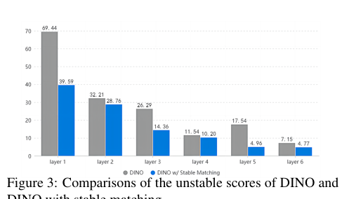
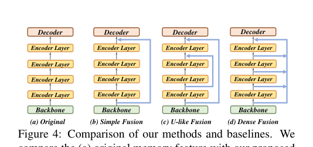
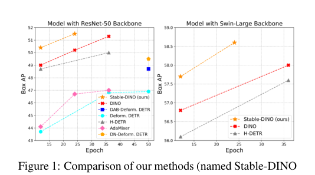
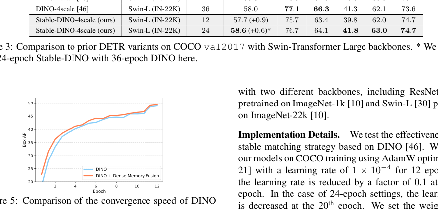
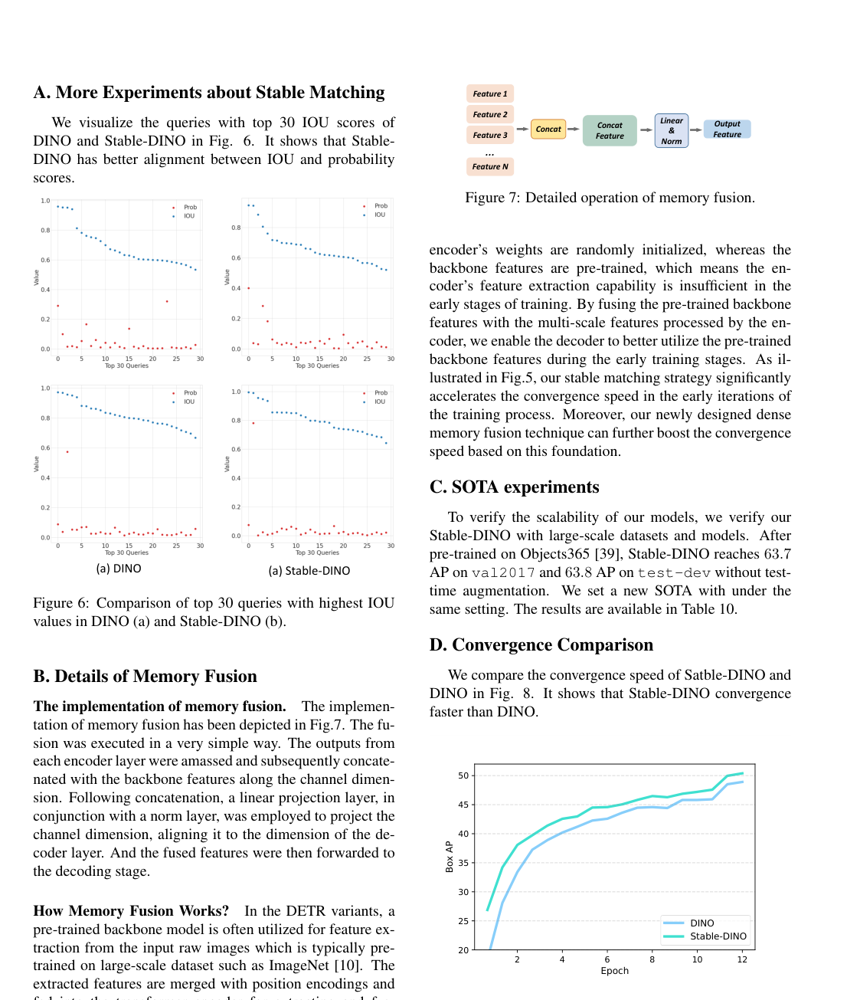
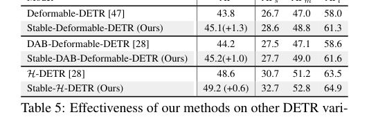

# 📄 Detection Transformer with Stable Matching

# Stable-DINO：基于位置监督损失的DETR稳定匹配方法分析

## 概要（TL;DR）
- **核心问题**：DETR类模型中的一对一匈牙利匹配策略存在“多优化路径问题”，导致训练不稳定和收敛缓慢。
- **解决方案**：提出**位置监督损失**，仅使用位置度量（如IoU）来监督分类分数，消除优化冲突；并引入**位置调制匹配成本**和**内存融合**技术以加速收敛。
- **关键成果**：在COCO基准上，Stable-DINO将DINO的AP提升了1.4个百分点（ResNet-50），且收敛速度显著加快，代码已开源。

## 📚 研究背景与动机
目标检测是计算机视觉的基础任务。以CNN为主的传统方法依赖锚框、非极大值抑制等手工组件。Detection Transformer (DETR) 的提出带来了革命，它利用Transformer架构和匈牙利匹配，实现了端到端的集合预测，消除了手工设计。然而，DETR也带来了新挑战，主要是**收敛速度慢**和**性能欠佳**。

后续研究（如Deformable DETR, DINO）通过可变形注意力、查询锚点、去噪辅助任务等技术改善了收敛性，但都未触及一个根本性问题：**一对一匈牙利匹配策略内在的训练不稳定性**。

本文指出，这种不稳定性的根源在于 **“多优化路径问题”** 。当两个不完美的预测（一个定位准但分类分数低，另一个定位差但分类分数高）竞争同一个真实目标时，标准匹配和损失函数会产生相互冲突的监督信号。模型会根据随机匹配到的预测，走上两条截然不同的优化路径，导致训练不一致且低效。

先前工作的局限在于，它们要么忽略了此问题，要么只是间接处理（如DN-DETR通过去噪任务），而**缺乏对损失函数本身的原则性分析和修改**。

本文的关键洞见是：**在端到端的一对一匹配框架下，要确保训练稳定高效，正样本的分类分数必须仅由其定位精度（如IoU）来监督，而不能由其自身预测的分类分数来监督**。这打破了循环依赖，消除了冲突路径，使DETR的优化目标与传统检测器（先基于位置选择正样本）重新对齐。

*直观展示DINO与Stable-DINO在匹配稳定性上的对比*

## 🔬 方法详解
Stable-DINO的核心是重新设计分类损失和匹配成本，以解决多优化路径问题。

### 1. 位置监督损失
传统DETR的分类损失（Focal Loss）强制所有正样本的分类分数趋近于1：
$$
L_{\text{cls}} = \sum_{i=1}^{N_{\text{pos}}} |1 - p_i|^\gamma \text{BCE}(p_i, 1) + \sum_{i=1}^{N_{\text{neg}}} p_i^\gamma \text{BCE}(p_i, 0)
$$
其中 $p_i$ 是预测的分类概率。

**位置监督损失** 则用位置度量 $s_i$（如IoU）的函数 $f_1(s_i)$ 来替代固定目标“1”：
$$
L_{\text{cls}}^{\text{(new)}} = \sum_{i=1}^{N_{\text{pos}}} \left(|f_1(s_i) - p_i|^\gamma \text{BCE}(p_i, f_1(s_i))\right) + \sum_{i=1}^{N_{\text{neg}}} p_i^\gamma \text{BCE}(p_i, 0)
$$
这里 $f_1(s) = \varepsilon(s^2)$，是一个凸函数变换。**其物理意义是：一个预测的分类目标值应与其定位质量成正比（高IoU则目标值高），而非盲目追求1.0。**

### 2. 位置调制匹配成本
在匈牙利匹配阶段，匹配成本决定了预测与真实目标的对应关系。标准分类匹配成本为：
$$
C_{\text{cls}}(i, j) = |1 - p_i|^\gamma \text{BCE}(p_i, 1) - p_i^\gamma \text{BCE}(1-p_i, 1)
$$
**位置调制匹配成本** 将原始分类分数 $p_i$ 用位置质量 $s_i'$（调整后的GIoU）进行调制：
$$
C_{\text{cls}}^{\text{(new)}}(i, j) = |1 - p_i f_2(s_i')|^\gamma \text{BCE}(p_i f_2(s_i'), 1) - (p_i f_2(s_i'))^\gamma \text{BCE}(1 - p_i f_2(s_i'), 1)
$$
其中 $f_2(s) = s^{0.5}$。**其作用是降低定位差的预测在匹配中的竞争力，促使匹配结果更倾向于定位准确的预测。**

### 3. 内存融合
为了加速早期收敛，论文提出了特征层面的内存融合技术。由于Transformer编码器是随机初始化的，而主干网络是预训练的，早期训练时编码器特征质量不高。内存融合将主干网络提取的丰富特征与编码器输出进行融合，使解码器能立即利用预训练特征。

*展示三种内存融合策略：(a)原始，(b)简单融合，(c)U型融合，(d)密集融合*

三种融合方式（简单、U型、密集）均通过拼接和线性投影实现，**不引入额外参数**。实验表明，密集融合效果最佳。

## 📊 实验验证
实验在COCO 2017等标准数据集上进行，以平均精度（AP）为主要评价指标。

### 主要结果
**在ResNet-50主干网络上（12轮训练）：**
- DINO-4scale基线：49.0 AP
- Stable-DINO-4scale：**50.4 AP** （+1.4 AP）
- Stable-DINO-5scale：**50.5 AP** （+1.1 AP）

**在更大的Swin-L主干网络上（12轮训练）：**
- DINO-4scale基线：56.8 AP
- Stable-DINO-4scale：**57.7 AP** （+0.9 AP）

提升幅度在目标检测领域被认为是**显著且具有实际意义**的。

*展示Stable-DINO与多种基线方法在ResNet-50和Swin-L主干上的性能对比*

### 消融实验
各组件贡献如下（基于ResNet-50）：
1.  DINO基线：49.0 AP
2.  + NMS (0.8)：49.2 AP （+0.2）
3.  + 位置监督损失：49.8 AP （+0.6）
4.  + 位置调制匹配成本：50.2 AP （+0.4）
5.  + 密集内存融合：50.4 AP （+0.2）

**位置监督损失是性能提升的最主要贡献者。**

### 收敛速度分析
Stable-DINO，尤其是结合了密集内存融合后，展现出**更快的收敛速度**。在训练早期，其性能提升明显快于原始DINO。

*对比DINO与加入密集内存融合的DINO的收敛曲线*

*对比DINO与Stable-DINO的收敛速度*

### 泛化性验证
方法在多种DETR变体（Deformable-DETR, DAB-Deformable-DETR, H-DETR, MaskDINO）上均取得一致提升（+0.6 至 +1.3 AP），证明了其通用性。

*展示方法在其他DETR变体上的有效性*

### 可复现性评估
- **代码**：已在GitHub开源 (`https://github.com/IDEA-Research/Stable-DINO`)。
- **框架**：基于detrex开发。
- **超参数**：学习率、随机种子（60）、损失权重等关键参数已明确给出。
- **风险点**：批次大小、具体硬件需求等细节未在论文中说明，需参考代码实现。

**总体可复现性评分：中等偏高（7/10）。**

## 💡 核心要点
1.  **直击根本**：首次明确并系统解决了DETR类模型因一对一匹配导致的“多优化路径”训练不稳定问题。
2.  **简洁有效**：核心修改（位置监督损失）概念清晰、实现简单，无需复杂结构改动，却能带来显著性能提升。
3.  **加速收敛**：提出的内存融合技术有效利用了预训练主干特征，大幅加快了模型训练早期的收敛过程。
4.  **通用性强**：方法不依赖于特定架构，在多种DETR变体上均验证有效，具有良好的可迁移性。
5.  **开源可复现**：论文提供了完整的代码实现和关键训练细节，为社区研究和应用提供了便利。

## 🔮 未来方向与局限性
**局限性：**
1.  **实验细节缺失**：论文未报告批量大小、GPU需求、训练时间等工程细节，也未提供多次运行结果的方差，统计严谨性可进一步加强。
2.  **比较公平性**：部分对比实验中，Stable-DINO使用了NMS（贡献+0.2 AP）或训练轮数不同，需注意对比条件。
3.  **理论深度**：方法虽有效，但理论分析相对直观，更深入的收敛性理论证明是未来的方向。
4.  **范围限定**：方法主要针对DETR家族模型，其思想与传统检测器的结合潜力有待探索。

**未来方向：**
1.  **理论拓展**：为位置监督损失提供更严格的理论收敛性保证。
2.  **跨范式应用**：探索将“基于位置监督分类”的思想应用于其他存在匹配冲突的视觉任务，如实例分割、姿态估计。
3.  **效率优化**：进一步研究更高效的特征融合方式，或探索在训练后期动态关闭融合以降低计算开销。
4.  **损失函数设计**：研究更优的变换函数 $f_1$, $f_2$，或将其设计为可学习的模块，以适应不同数据集和任务。