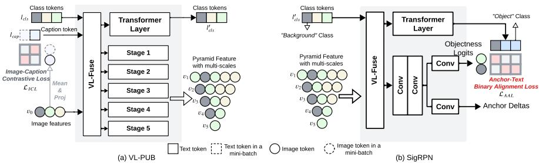
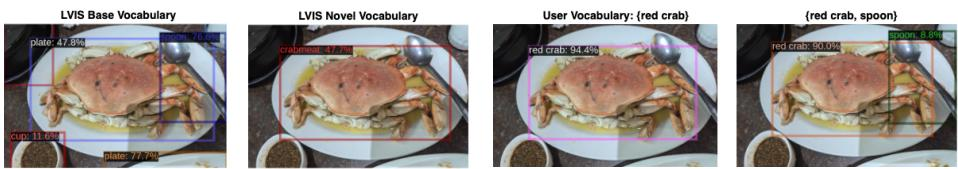
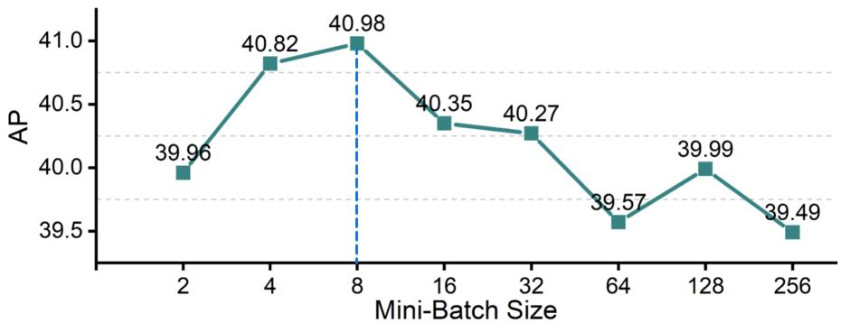
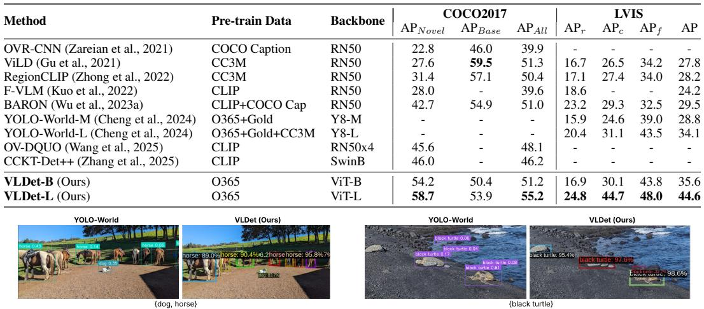

# 📄 ENHANCING OPEN-VOCABULARY OBJECT DE-TECTION THROUGH MULTI-LEVEL FINE-GRAINED VISUAL-LANGUAGE ALIGNMENT

# VLDet：迈向开放世界：多粒度视觉语言对齐的高效开放词汇目标检测分析

## 概要（TL;DR）
- **核心问题**：传统目标检测无法识别新类别，而现有开放词汇方法在适配强大的视觉语言模型（如CLIP）时，面临特征不匹配（单尺度 vs 多尺度）和高昂计算成本（依赖海量伪标签）的矛盾。
- **核心方案**：提出一个系统性解决方案：1) **VL-PUB模块**，轻量地将CLIP单尺度特征适配为多尺度特征金字塔；2) **三明治式对齐损失**，协同利用图像级、区域级和锚点级监督；3) **SigRPN**，将区域提案网络改造为开放词汇的物体发现器。
- **关键结果**：在标准基准（COCO, LVIS）上取得显著突破，尤其在未见过的类别上性能大幅提升（如COCO上达到58.7 AP），且训练仅需高质量检测数据和生成标题，避免了复杂伪标签流程。
- **主要挑战**：论文报告的SOTA结果非常突出，但**可复现性面临高风险**：官方代码和模型未开源，训练计算需求极高（64块A100），且缺少统计显著性分析。

## 📚 研究背景与动机
目标检测是计算机视觉的核心任务，但传统方法（如Faster R-CNN、YOLO）受限于训练时的固定类别集合，无法应对开放世界中层出不穷的新物体。

随着CLIP等视觉-语言模型（VLM）的出现，研究者开始探索**开放词汇目标检测（OVD）**，旨在让检测器能够根据任意文本描述（如“水豚”）来定位物体。然而，这篇论文**洞察到一个更深层的根本矛盾**：如何将主要为图像级分类设计的、拥有强大语义但空间信息较弱的CLIP特征，高效且无损地适配到需要密集、多尺度空间预测的目标检测任务中。

现有方法在处理这一矛盾时存在明显局限：
1.  **特征金字塔缺失**：要么直接使用CLIP的单尺度特征，损害多尺度检测能力；要么从零开始重训练多尺度主干，依赖海量噪声伪标签，计算成本高、流程复杂。
2.  **对齐策略偏颇**：要么只关注图像级对齐，缺失区域判别力；要么只关注区域级对齐，丢失了图像级上下文信息。
3.  **提案网络封闭**：传统的区域提案网络（RPN）在已知类别上训练，对全新类别物体不敏感，可能在新物体检测的源头就将其误判为背景。

因此，本文的核心任务是：**在不牺牲CLIP强大语义能力、不引入巨大开销的前提下，获得适合检测的多尺度特征，并设计一种能协同利用全局与局部信息、且能从源头发现新物体的对齐机制。**

## 🔬 方法详解
本文提出了一套端到端的架构，其核心在于**视觉语言金字塔上采样块（VL-PUB）**、**基于Sigmoid的视觉语言区域建议网络（SigRPN）** 和**多级细粒度对齐损失**的协同。

*此图清晰地展示了VLDet的核心架构，包括图像级对比损失的计算位置、VL-PUB生成多尺度特征金字塔的过程，以及SigRPN进行细粒度锚点-文本对齐的机制，是理解方法设计的关键。*

### 1. VL-PUB：高效的特征适配器
VL-PUB模块旨在解决CLIP单尺度特征与检测多尺度需求的不匹配。其关键创新是**双向交叉注意力机制**：
$$
\begin{aligned}
A_{V→L} &= \text{Softmax}\left(\frac{(VW_Q^V)(LW_K^L)^T}{\sqrt{d_k}}\right)(LW_V^L) \quad &\text{(视觉→语言)} \\
A_{L→V} &= \text{Softmax}\left(\frac{(LW_Q^L)(VW_K^V)^T}{\sqrt{d_k}}\right)(VW_V^V) \quad &\text{(语言→视觉)} \\
V' &= [A_{V→L}; A_{L→V}]W^O + V \quad &\text{(融合与残差)}
\end{aligned}
$$
- **物理直觉**：`V→L`注意力让每个像素点查询与之最相关的文本概念（例如，猫耳像素关联“猫”和“三角形”）；`L→V`注意力让每个文本标记定位到相关的图像区域（例如，“猫”这个词激活所有猫的像素）。双向设计确保了细粒度的像素-词汇对应。
- **工作流程**：VL-PUB从CLIP提取的最深层、高语义特征开始，通过多次与语言特征进行双向交叉注意力并上采样，逐步构建出一个完整的**视觉语言特征金字塔**，廉价地获得了检测所需的多尺度空间特征。

### 2. SigRPN：开放词汇的物体发现器
为了从源头提升新类别物体的发现能力，论文改造了传统RPN，提出SigRPN。其核心是**基于Sigmoid的锚点-文本对比损失**：
$$
\mathcal{L}_{\text{AAL}} = -\frac{1}{N}\sum_{i=1}^N \left[y_i\log\sigma(s_i) + (1-y_i)\log(1-\sigma(s_i))\right]
$$
其中，$s_i = \text{sim}(a_i, t)/\tau$是锚点特征$a_i$与文本特征$t$的相似度，$\sigma$是sigmoid函数，$y_i$是二元标签（是否匹配）。
- **物理直觉**：该损失让每个锚点独立地判断其与文本描述的匹配概率，相当于训练RPN成为一个“开放词汇的物体/背景分类器”。温度系数$\tau$控制判断的置信度。
- **优势**：避免了传统对比学习中的复杂负样本采样，处理密集锚点时更高效，且直接面向开放词汇设定进行优化。

### 3. 多级细粒度对齐损失：三明治监督
论文创新性地提出了一个三层次的对齐监督框架，构成性能提升的引擎：
- **顶层（图像级）**：$\mathcal{L}_{\text{ICL}}$，在VL-PUB之前计算图像与文本标题的对比损失，恢复全局上下文理解。
- **中层（区域级）**：由检测头（如Fast R-CNN）实现的标准区域-分类损失，确保每个提案框的精准分类。
- **底层（锚点级）**：$\mathcal{L}_{\text{AAL}}$，即上述SigRPN的损失，在最底层实现细粒度的开放词汇物体发现。

总对齐损失为各级损失的加权和：$\mathcal{L}_{\text{align}} = \lambda_{\text{img}} \mathcal{L}_{\text{ICL}} + \lambda_{\text{reg}} \mathcal{L}_{\text{region}} + \lambda_{\text{anchor}} \mathcal{L}_{\text{AAL}}$。这种“三明治”结构确保了从全局场景到局部细节的协同对齐。

## 📊 实验验证
论文在COCO和LVIS两个标准OVD基准上进行了全面评估，并与当前主流方法进行了对比。

### 突破性的性能表现

*此图直观展示了VLDet强大的开放词汇检测能力，能够准确检测从标准数据集中到用户自定义（如“黑色乌龟”）的各类物体，为论文宣称的高性能提供了视觉佐证。*

- **COCO数据集**：在17个未见过的（Novel）类别上，VLDet达到了**58.7%的AP**，相比之前最佳方法（46.0% AP）实现了**12.7个绝对百分点的巨大提升**（相对提升27.6%）。这是一个标志性的突破。
- **LVIS数据集**：在包含337个稀有类别的更具挑战性设定下，VLDet-L达到了**24.8% AP**，也超越了此前最佳方法。
- **关键优势**：这些SOTA结果是在**仅使用Objects365检测数据集及其生成标题进行预训练**的情况下取得的。而许多对比基线使用了更大、更复杂的数据集（如CC3M、GoldG），这使得VLDet的结果更具说服力，证明了其方法的高效性。

### 消融研究验证核心设计
消融实验系统性地验证了每个组件的必要性：
- **多级对齐损失**：在LVIS上的实验表明，添加图像级损失($\mathcal{L}_{\text{ICL}}$)和锚点级损失($\mathcal{L}_{\text{AAL}}$)能持续提升稀有类别的检测精度（`APr`从12.43提升至16.93）。
- **VL-PUB与训练策略**：在COCO闭集检测上验证了：1) 使用预训练CLIP编码器的重要性；2) VL-PUB带来的多尺度特征优于单尺度；3) 引入图像标题和$\mathcal{L}_{\text{ICL}}$损失带来明确增益。
- **图像级损失批次大小**：

*此图通过实验表明图像级对比损失在批次大小为8时达到最佳效果，为超参数选择提供了实证依据，增强了方法的严谨性。*

### 复现性审计与潜在问题
尽管结果出色，但独立复现面临挑战：
- **高风险**：**官方代码、模型权重和生成的标题数据均未提供**，这是最大的复现障碍。
- **高成本**：训练需要64块NVIDIA A100 GPU，门槛极高。
- **统计严谨性**：所有惊艳的SOTA结果均为单次运行值，未报告多次运行的标准差以评估稳定性。
- **效率对比不全面**：虽然计算量（GFLOPs）低于部分基线，但未提供与YOLO-World等高效模型在推理速度（FPS）上的直接对比。

*此图提供了VLDet与先前SOTA方法YOLO-World的直观检测效果对比，显示了VLDet在定位准确性（如对“黑色乌龟”的检测）上的优势，是性能声称的直观支撑。*

## 💡 核心要点
1.  **根本矛盾与系统性解决**：论文精准识别了将图像级VLM适配到密集检测任务时的“特征不匹配”与“对齐鸿沟”矛盾，并提出了一个涵盖特征适配、多级对齐和开放提案的系统性解决方案。
2.  **鱼与熊掌兼得**：通过轻量的VL-PUB模块，实现了在不损失CLIP语义能力的前提下，低成本获得检测所需的多尺度特征；通过三明治对齐损失，协同利用了不同粒度的监督信号。
3.  **源头创新**：SigRPN将传统封闭式RPN改造为开放词汇物体发现器，从检测流程的第一步就增强了对新类别的敏感性，是性能提升的关键之一。
4.  **高效数据策略**：方法仅需在高质量检测数据及生成标题上训练，避免了依赖海量噪声伪标签的复杂流程，更具可操作性和可复现性潜力。
5.  **卓越但需验证的性能**：报告的指标提升显著，若经得起复现检验，将是OVD领域的重大进展。但目前受限于可复现性风险，需谨慎看待。

## 🔮 未来方向与局限性
- **局限性**：当前方法最大的局限在于**可复现性门槛**。高昂的计算需求与未开源的实现细节，阻碍了社区的验证与进一步发展。此外，方法框架仍基于两阶段检测器，在推理速度上可能不及一些单阶段模型。
- **未来方向**：
    1.  **轻量化与效率提升**：探索更轻量的VL-PUB设计，或将框架适配到单阶段检测器，以提升推理速度。
    2.  **更强的基础模型**：将当前框架与更强大的VLM（如大型多模态模型）结合，探索性能极限。
    3.  **更复杂的开放世界理解**：超越简单的类别检测，迈向开放词汇的场景图生成、视觉推理等需要更细粒度对齐的任务。
    4.  **推动开源**：当务之急是作者开源代码、模型及数据，以接受社区检验，推动该方向实质性的进步。