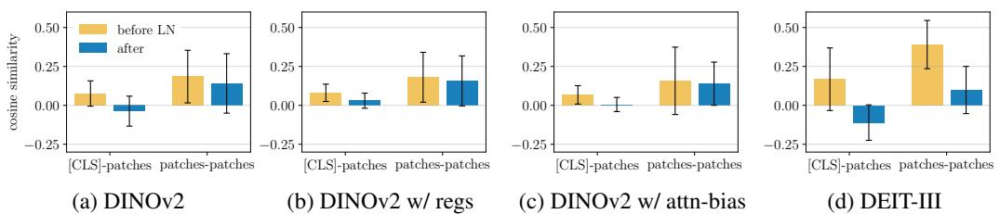
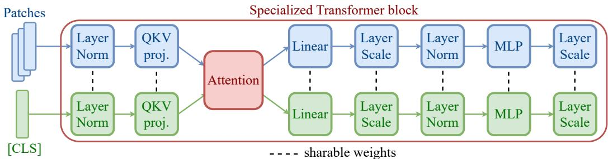
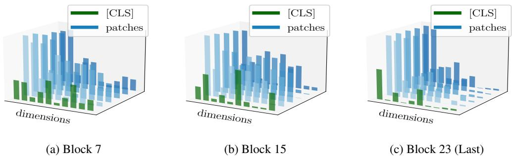
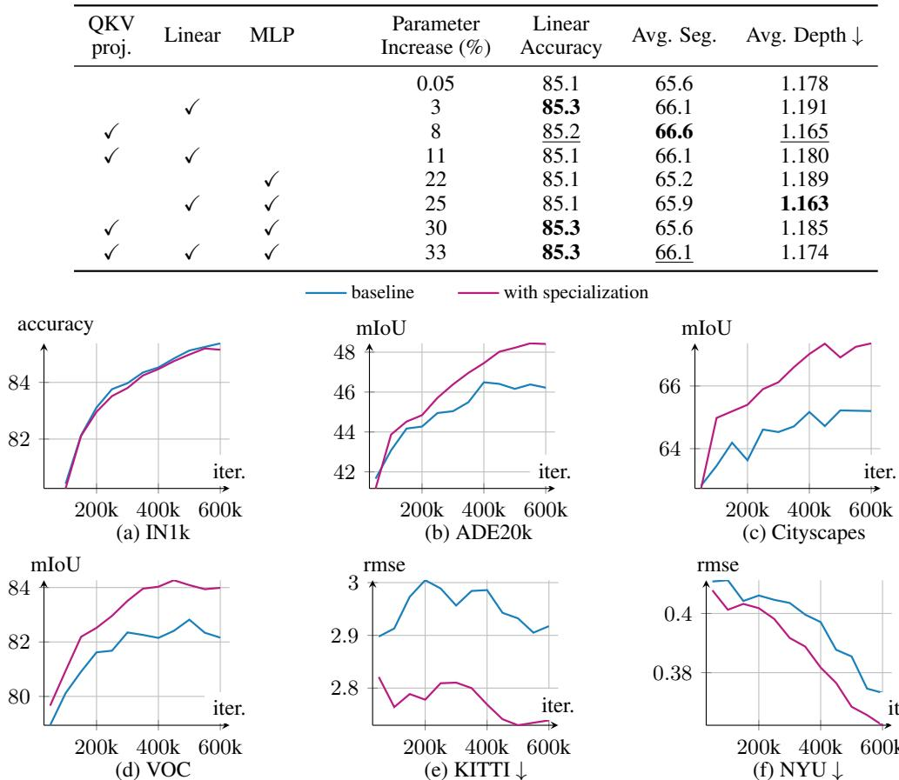
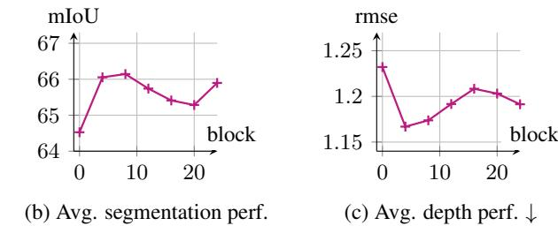

# 📄 REVISITING [CLS] AND PATCH TOKEN INTERACTION IN VISION TRANSFORMERS

# 视觉Transformer中[CLS]与图像块令牌的解耦：一项架构再思考

## 概要（TL;DR）
- **核心问题**：标准视觉Transformer（ViT）使用**完全相同的处理流水线**对待功能截然不同的[CLS]令牌（全局语义）和图像块令牌（局部细节），这种“一视同仁”的设计在两者之间引入了表征学习的**内部摩擦**，抑制了局部特征质量。
- **关键洞察**：模型自身已在“挣扎”——**归一化层（LayerNorm）的统计量隐式地学习区分**两种令牌。这为“摩擦”提供了内在证据，并指明了无需增加计算开销的轻量级修改方向。
- **高效方案**：提出**令牌特化**设计，仅为[CLS]和图像块令牌提供独立的归一化层及早期QKV投影参数。该方案参数量增加极小（完全特化约8.3%，LoRA版可低至1.4%），**计算开销（FLOPs）不变**。
- **验证结果**：在密集预测任务（语义分割、深度估计）上获得**显著性能提升**（如分割mIoU提升超过2点），同时保持全局分类性能基本不变。消融研究证实，**特化归一化层是取得增益的关键**。

## 📚 研究背景与动机
视觉Transformer（ViT）已成为构建视觉基础模型的主流架构。其标准流程将图像划分为块（patch）并嵌入为令牌序列，同时在序列开头添加一个可学习的类别（[CLS]）令牌。尽管[CLS]令牌旨在聚合全局信息，而图像块令牌携带局部细节，两者功能与语义本质不同，但现有ViT架构默认使用**完全相同的Transformer模块序列**对它们进行一致处理。

这种追求架构简洁性的“一视同仁”设计范式，可能忽略了两种令牌内在学习目标与表征需求的根本差异。特别是在密集预测任务（如分割、检测）对高质量局部特征需求日益增长的背景下，统一处理可能导致**学习摩擦**，使图像块令牌的表征质量受到抑制。因此，本文的核心动机是挑战“**统一处理不同性质令牌是ViT最优设计**”这一潜在共识。

先前的研究已意识到问题，并提出如“寄存器”或“注意力偏置”等方法。然而，这些方案多属于在统一框架上“打补丁”——或增加计算开销，或仅通过损失函数进行后处理约束，未能触及“共享所有计算层”这一根本设计。

本文最关键的核心洞察是：**在标准ViT中，归一化层（LayerNorm/GroupNorm）的统计量（均值μ和标准差σ）已经在隐式地、被动地学习区分[CLS]令牌和图像块令牌**。这一发现至关重要，因为它不仅为“摩擦”提供了内在证据，更指明了高效精准的修改方向：与其从外部添加复杂模块，不如将模型这种“自发”的区分行为**显式化、制度化**。由此，研究旨在回答：这种摩擦如何量化？其根源是否在于统一的计算管道？能否通过显式分离计算路径来提升性能？这种特化应如何进行，代价与收益如何？

## 🔬 方法详解
基于上述洞察，本文提出了一种目标明确的**架构专门化**方案：为[CLS]令牌和图像块令牌设计独立的计算路径，主要针对标准化层和注意力机制中的QKV投影矩阵。

### 1. 从隐式区分到显式特化：核心公式推导
**标准 LayerNorm（基线，问题所在）**：
在标准ViT中，所有令牌（1个[CLS] + N个图像块）共享同一个LayerNorm。给定序列 \(X \in \mathbb{R}^{(N+1) \times d}\)，其操作为：
$$
\text{LN}(x_i) = \gamma \odot \frac{x_i - \mu}{\sigma + \epsilon} + \beta
$$
其中统计量 \(\mu\) 和 \(\sigma\) 是从**整个序列**（混合了[CLS]和图像块）计算得出的。物理直觉上，这迫使两种分布不同的令牌被拉向一个共同的统计中心，模糊了功能区别。模型只能通过费力调整一套共享的仿射参数 \((\gamma, \beta)\) 进行低效的“隐式”区分。

*图3直观展示了标准LayerNorm对不同预训练模型的“分离”效应：在应用LayerNorm后，[CLS]与所有图像块之间的余弦相似度均值急剧下降（常趋近于0），而图像块彼此间的相似度变化不大。这证实了LayerNorm是模型隐式区分两种令牌的关键环节。*

**专门化 LayerNorm（提案，解决方案）**：
论文提出为两种令牌使用独立的LayerNorm模块，实现统计量计算的彻底隔离：
$$
\begin{aligned}
\text{LN}_{\text{cls}}(x_{\text{cls}}) &= \gamma_{\text{cls}} \odot \frac{x_{\text{cls}} - \mu_{\text{cls}}}{\sigma_{\text{cls}} + \epsilon} + \beta_{\text{cls}} \\
\text{LN}_{\text{patches}}(X_{\text{patches}}) &= \gamma_{\text{patches}} \odot \frac{X_{\text{patches}} - \mu_{\text{patches}}}{\sigma_{\text{patches}} + \epsilon} + \beta_{\text{patches}}
\end{aligned}
$$
其中，\(\mu_{\text{cls}}, \sigma_{\text{cls}}\) 仅从[CLS]令牌计算（实际上退化为仿射变换），\(\mu_{\text{patches}}, \sigma_{\text{patches}}\) 仅从N个图像块计算。这本质上是**GroupNorm思想在令牌类型维度上的特例**。这种设计将隐式适应变为显式设计，让两种令牌拥有专属的“调节旋钮”，减少了优化中的内部竞争。

**专门化 QKV 投影（提案，延伸解耦）**：
为了从数据流早期开始解耦，论文进一步提出在生成注意力查询（Q）、键（K）、值（V）时使用独立的投影矩阵：
$$
\begin{aligned}
[Q_{\text{cls}}, K_{\text{cls}}, V_{\text{cls}}] &= x_{\text{cls}} \cdot W_{QKV}^{\text{(cls)}} \\
[Q_{\text{patches}}, K_{\text{patches}}, V_{\text{patches}}] &= X_{\text{patches}} \cdot W_{QKV}^{\text{(patches)}}
\end{aligned}
$$
注意力计算本身保持不变（[CLS]的Q仍可与所有图像的K交互），但生成交互工具（Q,K,V）的变换实现了专门化。这允许[CLS]学习提出更宏观的“问题”，而图像块学习提供更局部的“索引”和“信息”。为提升参数效率，也可使用**LoRA（低秩适应）**来近似这种专门化。

### 2. 架构实现与原理分析

*图5清晰地展示了提案的专门化架构如何集成到标准Transformer块中：输入序列在进入块时被分割，分别通过独立的归一化层和QKV投影，而后在注意力层中重新交互，保持了信息流的同时实现了处理路径的解耦。*

**维度分离的内在机制**：

*图4揭示了“摩擦”及特化有效的内在原因：随着网络加深，[CLS]和图像块令牌的激活在不同特征维度上逐渐“分道扬镳”（维度分离）。统一LayerNorm的全局统计量计算会被“非主导”令牌“污染”，而特化LayerNorm完美适配了这种天然趋势。*

**梯度流与表示解耦**：
从优化角度看，特化设计确保了梯度通过独立路径回流。更新\(W_{QKV}^{\text{(cls)}}\)的梯度仅来源于[CLS]令牌的损失，反之亦然。这提供了更干净、更直接的优化信号，最小化了共享参数模型中可能存在的梯度冲突，从而从根本上减轻了“摩擦”。

## 📊 实验验证
论文在多个标准基准上进行了广泛实验，以验证所提方法的有效性和普适性。

### 实验设置
- **模型与预训练**：基于ViT-S/B/L架构，主要在DINOv2和DeiT-III框架下进行预训练和评估。
- **任务与数据集**：
    - **分类**：ImageNet-1K（线性探测）。
    - **密集预测**：语义分割（ADE20K, Cityscapes, Pascal VOC）、深度估计（KITTI, NYU Depth v2, SUN RGB-D）、目标检测（COCO）。
- **对比基线**：标准ViT、带注意力偏置的ViT、带寄存器令牌的ViT。

### 主要结果与分析
**性能提升显著**：在DINOv2预训练的ViT-L上，最佳特化模型（特化归一化层+QKV投影）相比基线，在分割任务上实现了**+2.1 mIoU**的绝对提升（64.5 → 66.6），相对提升约3.3%；在深度估计任务上，RMSE降低了5.4%（1.232 → 1.165）。关键的是，这些提升是在**保持ImageNet分类准确率基本不变**的前提下取得的。

*图9展示了在训练过程中，特化模型（蓝线）在密集预测任务（分割、深度估计）上的性能持续且显著优于基线（橙线），同时分类任务性能保持同步，验证了方法释放局部特征潜力而不损害全局表征的能力。*

**消融研究验证核心设计**：
1.  **各组件贡献**：特化归一化层是**取得增益的关键**，仅此一项即可带来+1.1 mIoU提升，且参数量增加极微（0.05%）。仅特化QKV投影则增益微弱（+0.2 mIoU），说明摩擦根源确实在归一化层。
2.  **特化范围**：仅在模型**前1/3的层**进行特化即可获得大部分收益，提高了方法的实用性。
3.  **参数效率**：使用LoRA近似QKV特化，可将额外参数量从8.3%大幅压缩至1.4%，同时保留大部分性能增益（65.9 vs 66.6 mIoU），显示出优秀的权衡。

*图8 (a)(b) 通过消融实验直观展示了不同特化组件（Norms， QKV）对分割性能的贡献，以及特化范围（模型深度）与性能增益的关系。*

**普适性验证**：
- **模型规模**：方法在ViT-S, B, L规模上均有效。
- **预训练框架**：在DINOv2上效果最显著。在DeiT-III上虽也有增益，但训练后期优势有所稀释（见附录），表明其有效性可能部分依赖于预训练目标。

### 复现性与局限性评估
**可复现性风险**：
- **优点**：使用的均为公开数据集；下游任务（线性评估、检测）的超参数大多明确。
- **高风险缺失**：
    1.  **关键结果表格缺失**：提供的摘要中缺少主要结果表（Table 1-4），无法验证各数据集的独立表现。
    2.  **预训练细节不透明**：严重依赖“默认配置”，但未提供批量大小、优化器关键参数、学习率调度器等核心信息。
    3.  **统计显著性未报告**：所有结果均为单次运行值，未提供方差或显著性检验。
    4.  **计算开销声称未验证**：声称“无额外FLOPs”但未提供任何定量对比数据。
    5.  **代码与模型未发布**：在提供章节中未声明代码或模型权重的可用性。

## 💡 核心要点
1.  **挑战统一处理范式**：本文成功挑战了ViT中对[CLS]和图像块令牌“一视同仁”处理的潜在最优假设，揭示了其导致的内部表征摩擦。
2.  **从现象到本质的洞察**：通过严谨分析，发现**归一化层的统计量隐式区分令牌**是模型自身“挣扎”的证据，这一发现将问题定位从模糊的“干扰”精确到了具体的模块行为。
3.  **高效精准的解决方案**：提出的**令牌特化**方案（独立归一化+QKV投影）直击问题根源。它参数增加少，**不增加计算开销**，实现了“四两拨千斤”的架构修改。
4.  **显著的密集任务增益**：方法能显著提升图像块令牌的表示质量，从而在分割、深度估计等密集预测任务上获得实质性性能进步，同时不损害全局分类能力。
5.  **启发新的设计原则**：这项工作超越了具体的技巧，为设计下一代视觉Transformer提供了一个重要原则：**应根据令牌的语义角色和功能需求，考虑差异化的处理路径**。

## 🔮 未来方向与局限性
**局限性**：
1.  **实验报告完整性不足**：如数据审计员所指，结果统计显著性缺失、预训练细节模糊、与SOTA密集预测模型的端到端对比缺乏，影响了工作的严谨性和可复现性。
2.  **预训练框架依赖性**：方法在DINOv2上效果最佳，在DeiT-III上的泛化性略有折扣，表明其与预训练目标的耦合关系有待进一步研究。
3.  **理论分析待深化**：对“摩擦”的微观机理（如梯度冲突的具体形式）和特化后优化动态的理论解释尚可深入。

**未来方向**：
1.  **扩展到更多令牌类型**：当前工作聚焦于[CLS]与图像块。未来可探索ViT中其他功能性令牌（如蒸馏令牌、寄存器令牌）的特化设计。
2.  **自动化特化策略**：能否设计机制，让模型自动学习不同令牌或不同网络深度所需的特化程度，而非手动指定？
3.  **与高效架构设计结合**：将令牌特化思想与更广泛的神经网络架构搜索（NAS）或动态网络技术结合，以学习最优的差异化计算图。
4.  **应用于多模态模型**：该原则可启发多模态Transformer的设计，为不同模态（文本、图像、音频）提供更专有的早期处理路径，而非简单拼接后统一处理。