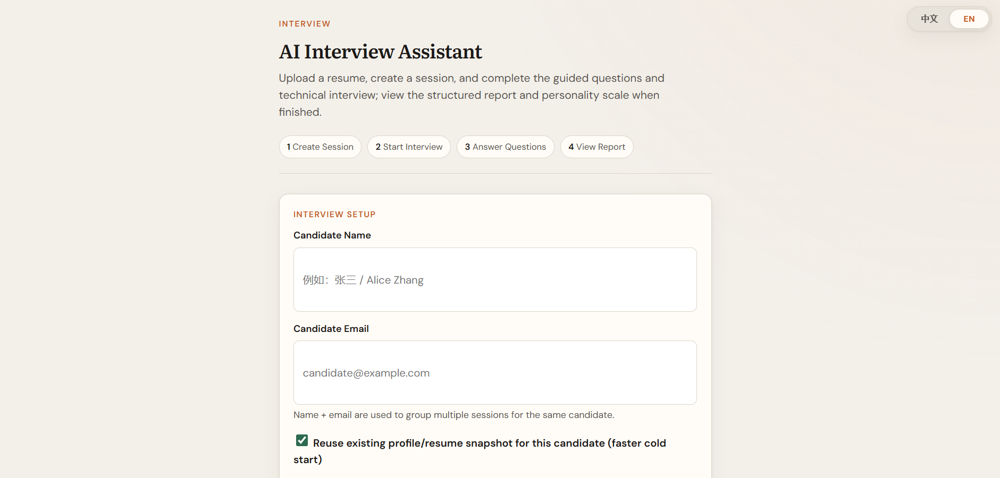
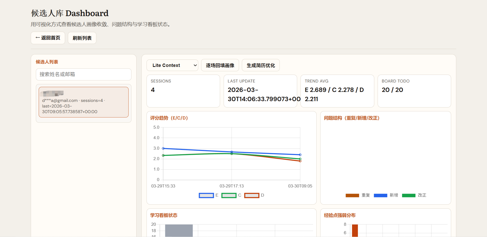
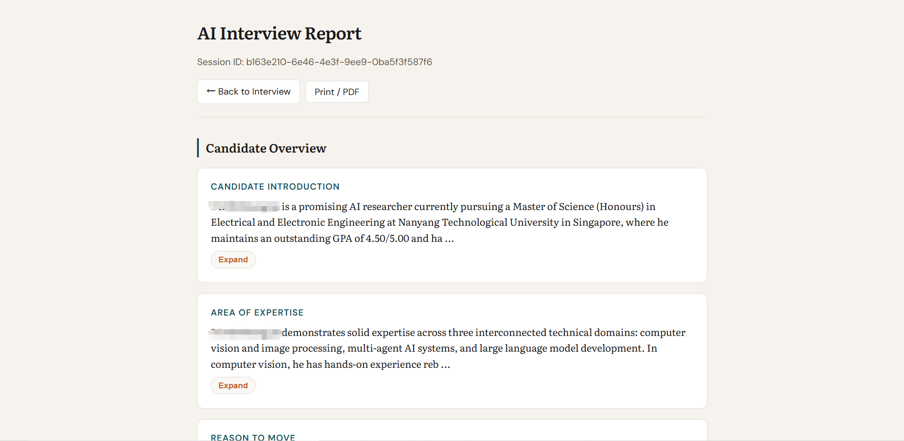

# AI Interview Agent

**类型**：开源项目 | **GitHub**：[GoDiao/ai-interview-agent](https://github.com/GoDiao/ai-interview-agent)

智能面试助手系统，通过持久化候选人档案实现跨会话的成长追踪。



## 核心功能

**持久化候选人档案** - 每次面试自动更新候选人成长轨迹

**智能问题追踪** - 自动标记新问题、重复问题、已解决问题

**学习看板** - 可视化展示候选人需要改进的领域

**趋势分析** - Dashboard展示分数趋势、问题分布、经验热力图



## 技术架构

**后端**：FastAPI + Pydantic + 异步编排

**前端**：HTML/CSS/JS + Chart.js

**存储**：JSON分片存储架构

**LLM**：OpenAI兼容API



## 关键特性

* 显式状态机面试流程（intro → technical → personality → report）
* 候选人库按 `name + email` 索引实现跨会话连续性
* 自动会后复盘（重复问题、新问题、已修复问题）
* 从原始Q&A回填档案，渐进式完善独立库档案
* 分片存储架构：将庞大的 `candidate.json` 分解为可维护文件

## 快速开始

```bash
git clone https://github.com/GoDiao/ai-interview-agent.git
cd ai-interview-agent
python -m venv .venv
.venv\Scripts\activate  # macOS/Linux: source .venv/bin/activate
pip install -r requirements.txt
cp .env.example .env
python run.py
```

访问 `http://127.0.0.1:8765`

## 项目链接

* [GitHub仓库](https://github.com/GoDiao/ai-interview-agent)
* [返回项目列表](../README.md)
