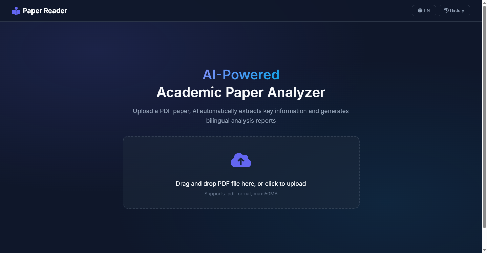
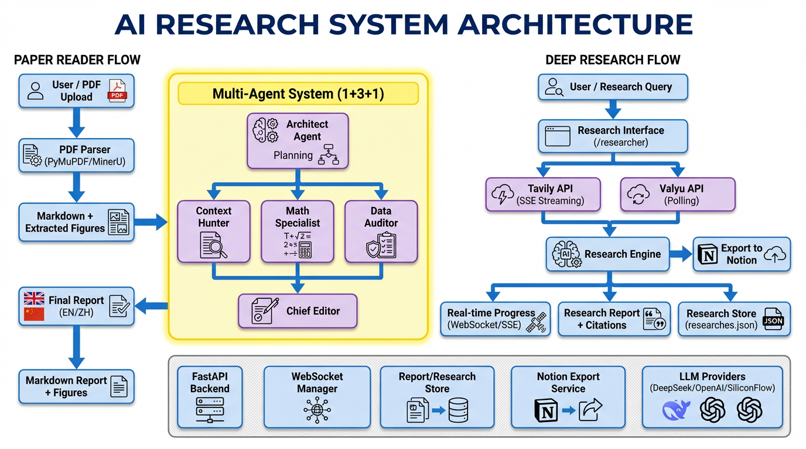
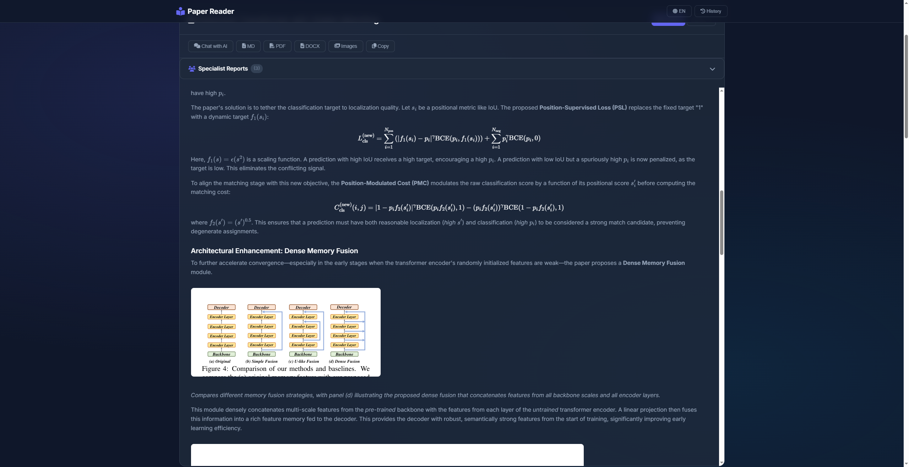

# Paper Reader Agent

**类型**：开源项目 | **GitHub**：[GoDiao/Paper-Reader](https://github.com/GoDiao/Paper-Reader)

## 写在前面

读论文时，我们都希望有工具能快速帮助理解。起初我习惯把论文丢给 DeepSeek 或 Claude，但很快发现一个问题：生成的 summary 太浅显——文字看起来通俗易懂，实际上看完脑子里什么都没留下。模型架构怎么设计的？数学公式怎么推导的？还是得回到原文对着看。

这种"看了等于没看"的体验让我决定开发这个工具。核心思路是：用 MinerU 做高保真 PDF 解析，然后设计多个专业 Agent 分工协作——Context Hunter 挖掘背景动机、Math Specialist 推导公式、Data Auditor 审查实验数据——最后由 Editor 整合成一份真正有深度的分析报告。

这是一个能帮你真正理解论文的研究助手。



## 核心功能

**分层多智能体架构（1+3+1）** - 模拟专业研究团队

* **Architect**：解构论文并规划阅读策略
* **Specialist Team**：Context、Math、Data三个并行专家
* **Editor**：合成出版级报告并嵌入图表

**视觉理解** - 检测、提取并"看见"图表，直接嵌入分析中

**Deep Research** - 基于Tavily和Valyu的AI网络研究工具

**双语报告** - 同时生成英文和中文原生质量报告



## 技术架构

**后端**：FastAPI + 异步编排 + 多智能体系统

**前端**：现代Web UI + 实时进度追踪

**PDF解析**：PyMuPDF（快速）/ MinerU（高保真）双引擎

**LLM**：DeepSeek / OpenAI兼容API



## 关键特性

* 智能PDF解析管道（表格提取、数学公式区域检测）
* 实时流式响应（逐token生成报告）
* 迭代分析与Gap Agent（自动识别信息缺口）
* 一键导出到Notion（原生表格、LaTeX公式）
* 研究历史管理（浏览、搜索、删除）
* 多种引用格式（Numbered、APA、MLA、Chicago）

## 快速开始

```bash
git clone https://github.com/GoDiao/Paper-Reader.git
cd Paper-Reader
python -m venv .venv
source .venv/bin/activate  # Windows: .venv\Scripts\activate
pip install -r requirements.txt
cp .env.example .env
python web_server.py
```

访问 `http://localhost:8000` 使用Paper Reader，或访问 `http://localhost:8000/researcher` 使用Deep Research。

## 项目链接

* [GitHub仓库](https://github.com/GoDiao/Paper-Reader)
* [返回项目列表](../README.md)
